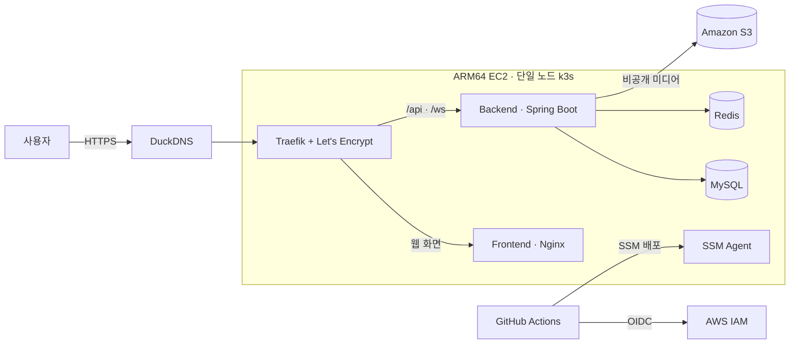

# Talk With Neighbors API

[](https://github.com/gitUserKHS/talk_with_neighbors_back/actions/workflows/ci.yml)

이웃톡의 인증, 피드 추천, 관심사 매칭, 취미 모임, 실시간 채팅, 알림 및 안전 기능을 제공하는 Spring Boot 3 백엔드입니다.

## 운영 구조



운영 요청은 DuckDNS 도메인과 Traefik의 HTTPS Ingress를 거쳐 프런트엔드 또는 백엔드로 전달됩니다. GitHub Actions는 장기 자격 증명 대신 OIDC로 AWS 권한을 획득하고, SSM을 통해 digest로 고정된 컨테이너 이미지를 k3s에 배포합니다. 자세한 운영 절차는 [AWS EC2 + S3 + k3s 가이드](docs/deployment/aws-k3s.md)를 참고하십시오.

## 주요 기능

- 세션 및 카카오 소셜 로그인
- 이미지·동영상 피드, 좋아요, 댓글, 숨김, 차단 및 신고
- 관심사·거리·최신성·참여도를 조합한 피드 추천
- 관심사 기반 사용자 매칭과 취미 모임
- 1:1·그룹 채팅, 첨부 파일, 읽음 상태 및 알림
- 채팅방 일정, 참석 여부 및 참여자 관리
- MySQL·Redis 연동, 비공개 S3 미디어 저장소

## 피드 조회

인증된 피드는 다음 정렬 모드를 지원합니다. `mode`를 생략하면 `RECOMMENDED`가 적용됩니다.

- `GET /api/feed?mode=RECOMMENDED`
- `GET /api/feed?mode=NEARBY`
- `GET /api/feed?mode=LATEST`

추천 모드는 관심사 35%, 거리·지역 25%, 최신성 25%, 참여도 15%를 사용합니다. 가까운 모드는 거리·지역 비중을 65%로 높입니다. 사용자가 숨긴 게시글과 양방향 차단 관계의 작성자는 DB 쿼리에서 먼저 제외한 뒤 최대 500건의 안전한 후보만 점수화합니다. 노출 이력이나 위치 이력은 저장하지 않으며, 정확한 거리도 응답하지 않습니다. 작성자가 동네 공개에 명시적으로 동의하고 유효한 위치를 설정한 경우에만 시·군·구 수준의 동네 이름을 제공합니다. 동일 점수는 작성 시각과 게시글 ID의 내림차순으로 정렬하여 페이지 순서를 결정적으로 유지합니다.

후보의 좋아요 수, 댓글 수, 현재 사용자의 좋아요 여부는 각각 한 번의 집계 쿼리로 조회합니다. 작성자는 entity graph로 함께 읽고 미디어, 게시글 관심사, 작성자 관심사는 `default_batch_fetch_size=100`으로 묶어 조회하여 후보 수에 비례하는 lazy-loading 쿼리를 방지합니다. `LATEST`는 전체 게시글을 메모리에 올리지 않고 동일한 안전 필터와 DB 페이지네이션을 사용합니다.

## 익명 공개 API

다음 기본 콘텐츠는 로그인 없이 조회할 수 있습니다.

- `GET /api/public/feed`
- `GET /api/public/meetups`

공개 피드는 `RECOMMENDED`, `NEARBY`, `LATEST` 모드를 동일하게 지원합니다. 비회원 추천은 최신성·참여도와 선택적으로 전달된 `region`만 사용합니다. `region`은 공백을 정규화한 시·도 한 토큰 또는 시·도와 시·군·구 두 토큰만 허용하며, 동네 공개에 명시적으로 동의한 작성자의 주소 앞부분과 정확히 일치할 때만 반영합니다. 도로명·번지와 부분 문자열은 순위 신호로 사용하지 않고 요청값도 저장하지 않습니다.

피드는 작성자가 `publicPreview=true`로 명시적으로 공개한 게시글만 제공합니다. 일반 회원 작성자는 `이웃`으로 익명화하고 `SYSTEM` 계정의 콘텐츠만 `이웃톡 운영팀`으로 표시합니다. 댓글 내용과 댓글 작성자 정보는 공개 API에서 제공하지 않습니다. 콘텐츠 작성, 좋아요·댓글 조회 및 작성, 모임 참여, 채팅, 개인정보 조회에는 로그인이 필요합니다.

`APP_OFFICIAL_CONTENT_ENABLED=true` 환경에서는 로그인과 매칭이 불가능한 `SYSTEM` 계정이 운영팀 게시글·댓글·공개 모임을 멱등하게 준비합니다. 결정적 UUID를 사용하므로 재배포 시 중복되지 않으며, 공개 응답의 `official=true` 값으로 운영팀 콘텐츠를 구분합니다.

## 로컬 실행

Java 17, MySQL 8, Redis 7, FFmpeg/FFprobe가 필요합니다. 제공되는 Docker 이미지에는 FFmpeg가 포함되어 있습니다.

```bash
./gradlew bootRun --args='--spring.profiles.active=local'
```

프런트엔드와 백엔드 저장소를 같은 상위 디렉터리에 배치하면 다음 명령으로 전체 로컬 스택을 실행할 수 있습니다.

```bash
docker compose -f compose.local.yml up --build -d
```

프로필·피드·채팅 미디어는 `uploads_data` Docker 볼륨에 저장됩니다. 모든 로컬 데이터를 삭제하려는 경우가 아니라면 `docker compose down -v`를 사용하지 마십시오. 종료 명령은 다음과 같습니다.

```bash
docker compose -f compose.local.yml down
```

## 검증

```bash
./gradlew clean test
```

PR과 `main`, `codex/**`, `agent/**` 브랜치에서는 GitHub Actions가 단위 테스트, `bootJar`, 프로덕션 이미지, MySQL·Redis 연동 컨테이너 스모크 테스트를 검증합니다. `main`과 버전 태그의 이미지는 동일한 품질 검증을 통과한 뒤 GHCR에 게시됩니다.

운영 배포는 migration gate, 사전 DB 백업, 불변 이미지 digest, 외부 스모크 테스트 및 S3 릴리스 이력을 사용합니다. Terraform `apply`는 자동 실행하지 않으며 계획을 검토한 뒤 수동으로 수행합니다.

## 문서

전체 시스템 구조, 기능 명세, 데이터 모델, 데이터 흐름, API, 안전 정책 및 운영 절차는 [기술 문서 목차](docs/README.md)에서 확인할 수 있습니다.
