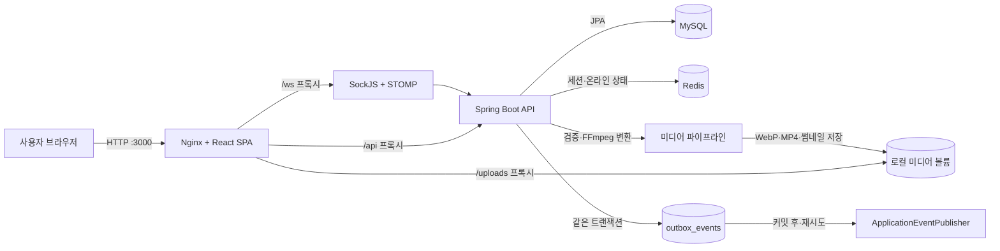

# 시스템 개요

## 제품 목적

이웃톡은 가까운 지역의 사용자가 관심사를 중심으로 피드를 공유하고, 이웃을 추천받고, 취미 모임과 채팅으로 관계를 이어가는 커뮤니티 서비스다.

## 현재 아키텍처

현재 백엔드는 하나의 Spring Boot 애플리케이션과 하나의 데이터베이스를 사용하는 **계층형 모놀리스**다. 서비스별 독립 배포나 Kafka 브로커는 아직 사용하지 않는다.



## 기술 스택

| 영역 | 기술 | 역할 |
|---|---|---|
| 프론트엔드 | React 19, TypeScript, Vite, MUI, Redux Toolkit | SPA 화면과 클라이언트 상태 |
| API | Java 17, Spring Boot 3.2, Spring MVC | REST API와 업무 규칙 |
| 실시간 | Spring WebSocket, SockJS, STOMP | 채팅과 사용자별 알림 |
| 영속 저장소 | MySQL 8.4, Spring Data JPA | 사용자, 피드, 매칭, 채팅, 알림 데이터 |
| 미디어 처리 | FFmpeg·FFprobe | 이미지 WebP 압축, 영상 H.264/AAC 변환, WebP 썸네일과 메타데이터 생성 |
| 미디어 저장소 | Docker `uploads_data` 볼륨 | 프로필·피드·채팅의 최적화 미디어와 파일 첨부 |
| 임시 저장소 | Redis 7.4 | 세션, 온라인 상태, 대기 중 매칭, 현재 채팅방 |
| 프록시 | Nginx | SPA 제공, `/api`, `/ws`, `/uploads` 역방향 프록시 |
| 실행 | Docker Compose | 프론트, 백엔드, MySQL, Redis 통합 실행 |
| 자동화 | GitHub Actions, Terraform, Kustomize | 테스트·이미지 게시·k3s 배포; 인프라 생성은 승인 후 수동 적용 |

## 저장소 구조

```text
talk_with_neighbors/
├─ docker-compose.yml              # 로컬 풀스택 실행
├─ .env.example                    # 로컬 환경 변수 예시
├─ docs/                           # 기술 문서
├─ talk_with_neighbors_front/
│  ├─ src/pages/                   # 라우트 화면
│  ├─ src/components/              # 공통·채팅·알림 UI
│  ├─ src/services/                # REST/WebSocket 클라이언트
│  ├─ src/store/                   # Redux 상태
│  ├─ deploy/nginx.conf            # 운영 프록시와 캐시 정책
│  └─ .github/workflows/           # 프론트 CI/CD
└─ talk_with_neighbors_back/
   ├─ src/main/java/.../controller # HTTP/STOMP 진입점
   ├─ src/main/java/.../service    # 업무 규칙
   ├─ src/main/java/.../repository # JPA 접근
   ├─ src/main/java/.../entity     # 데이터 모델
   ├─ compose.production.yml       # GHCR 기반 운영 Compose
   └─ .github/workflows/           # 백엔드 CI/CD
```

## 백엔드 논리 영역

현재 코드는 기술 계층별 패키지로 구성되어 있지만 업무상 경계는 다음과 같다.

- 인증·프로필: 가입, 로그인, 세션, 프로필, 프로필 사진 업로드, 온라인 상태
- 피드: 다중 사진·동영상 게시물, 좋아요, 댓글
- 매칭: 선호 조건, 추천, 요청, 수락·거절, 거리 검색
- 모임: 공개 그룹 채팅방을 활용한 취미 모임
- 채팅: 채팅방, 참가자, 텍스트·다중 미디어·문서 메시지, 읽음 상태
- 알림: 실시간 개인 큐와 오프라인 알림 저장·재전송
- 도메인 이벤트: 매칭 성사와 모임 참가 이벤트를 Outbox에 기록한 뒤 커밋 후 전달

향후에는 이 경계를 기준으로 모듈형 모놀리스로 정리하되, 곧바로 서비스별 배포 단위로 분리하지 않는다.

## 인증 경계

현재 인증은 JWT가 아니라 `X-Session-Id` 헤더와 Redis 세션을 사용한다. 로그인과 가입 응답 헤더로 세션 ID를 전달하고 이후 API와 WebSocket 연결에서 재사용한다. 설정에 JWT 항목이 존재하지만 현재 핵심 인증 흐름에는 사용되지 않는다.
