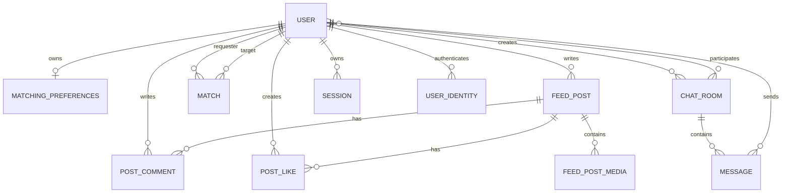

# 데이터 모델

## 영속 데이터 관계

`OFFLINE_NOTIFICATION`은 외래키 객체 대신 `user_id` 값을 직접 보관한다.

## 주요 테이블

| 테이블 | 식별자 | 주요 데이터 |
|---|---|---|
| `users` | 증가형 `Long` | 이메일, 사용자명, 비밀번호 해시, 비밀번호 로그인 허용 여부, `MEMBER`/`SYSTEM`, 프로필, 위치, 온라인 상태 |
| `user_identities` | 증가형 `Long` | 공급자·불변 subject·사용자 FK·검증 이메일·마지막 로그인; 공급자 token은 저장하지 않음 |
| `email_verification_challenges` | 무작위 UUID | 정규화 이메일, 코드/proof HMAC 해시, 만료·쿨다운·실패 횟수·확인·1회 소비 시각 |
| `user_interests` | 사용자 FK + 값 | 사용자 관심사 목록 |
| `matching_preferences` | 증가형 `Long` | 거리·나이·성별 조건, 사용자 1:1 관계 |
| `matching_preferences_interests` | 선호 FK + 값 | 선호 관심사 목록 |
| `matches` | UUID 문자열 | 두 사용자, 상태, 생성·만료·응답 시각 |
| `feed_posts` | UUID 문자열 | 작성자, 대표 미디어 URL, 설명, 공개 미리보기 opt-in(`public_preview`, 기본 `false`), 생성·수정 시각 |
| `feed_post_media` | 게시물 FK + 순서 | 원본·썸네일 URL, `IMAGE`/`VIDEO`, MIME, 바이트, 해상도, 재생시간, 표시 순서 |
| `feed_post_interest_tags` | 게시물 FK + 값 | 피드 관심사 태그 |
| `post_likes` | 증가형 `Long` | 게시물·사용자, 생성 시각; 조합 유일 |
| `post_comments` | UUID 문자열 | 게시물, 작성자, 내용, 생성 시각 |
| `chat_rooms` | UUID 문자열 | 이름, 타입, 공개 여부, 설명, 장소명·주소·위도·경도·카카오 장소 ID, 정원, 일정·참가 마감, 생성자 |
| `chat_room_participants` | 방 FK + 사용자 FK | 채팅방 참가자 |
| `chat_room_interest_tags` | 방 FK + 값 | 모임·채팅방 태그 |
| `messages` | UUID 문자열 | 방, 발신자, 내용, 타입, 생성·수정·삭제 상태 |
| `message_attachments` | 메시지 FK + 순서 | 원본·썸네일 URL, `IMAGE`/`VIDEO`/`FILE`, 원래 파일명, MIME, 바이트, 해상도, 재생시간 |
| `message_read_by` | 메시지 FK + 사용자 ID | 메시지 읽음 사용자 집합 |
| `sessions` | 문자열 | 사용자, 마지막 접근, 만료 시각 |
| `offline_notifications` | 증가형 `Long` | 사용자 ID, 유형, JSON 데이터, 우선순위, 발송·재시도 상태 |
| `outbox_events` | 이벤트 UUID | 타입, 집합 ID, JSON 페이로드, 발행·재시도 상태 |

## 주요 열거형

- 매칭 상태: `PENDING`, `ACCEPTED`, `REJECTED` 등 `MatchStatus` 정의값
- 채팅방 유형: `ONE_ON_ONE`, `GROUP`
- 메시지 유형: `ENTER`, `LEAVE`, `TEXT`, `IMAGE`, `VIDEO`, `FILE`, `SYSTEM`
- 알림 유형: 새 메시지, 매칭 요청·수락·거절, 방 삭제, 읽지 않음 갱신, 시스템 공지 등

## Redis 키 공간

| 키 패턴 | 값 | 기본 목적/수명 |
|---|---|---|
| `session:{sessionId}` | 직렬화된 `UserSession` | 인증 세션, 약 24시간 |
| `online:{userId}` | 온라인 표시 | 접속 상태, 약 5분 |
| `pending_match:{userId}` | 매칭 대기 정보 | 대기 매칭 처리 |
| `user_current_room:{userId}` | 현재 방 ID | 채팅방 입장 상태, 약 30분 |

Redis 데이터는 복구 가능한 임시 상태로 취급한다. 사용자·메시지·매칭의 최종 기록은 MySQL이 기준이다.

## 데이터 무결성 규칙

- 사용자 이메일과 사용자명은 유일해야 한다.
- 좋아요는 `(post_id, user_id)` 조합이 유일하다.
- 채팅방 생성자는 필수다.
- 메시지는 채팅방과 발신자를 반드시 참조한다.
- 매칭은 생성 시 기본 `PENDING`, 기본 만료 시각은 24시간 후다.
- 페이지 크기는 피드·모임 API에서 최대 50으로 제한한다.
- 모임 위도·경도는 둘 다 null이거나 둘 다 존재해야 하며 각각 `[-90, 90]`, `[-180, 180]` 범위여야 한다.
- 로그인 없는 공개 모임 DTO에는 장소명·주소·좌표·외부 장소 ID를 포함하지 않는다.
- 피드 공개 미리보기는 작성자가 명시적으로 opt-in한 게시글만 허용하며, 기존 행과 옵션 누락은 DB 기본값 `false`로 비공개다.
- 공개 미리보기는 작성자를 익명화하고 댓글 내용·댓글 작성자 정보를 제공하지 않는다.
- 게시글 미디어는 최대 10개이며 `(post_id, sort_order)`가 기본 키다.
- 로컬 파일명은 사용자 파일명 대신 서버가 생성한 UUID를 사용한다.
- 파일명은 표시용 메타데이터로만 보존하며 저장 경로에는 사용하지 않는다.
- 방을 일괄 삭제할 때 `message_attachments` 행을 메시지보다 먼저 지우고, 커밋 뒤 실제 파일을 삭제한다.
- Outbox 이벤트 ID는 소비자의 멱등 키로 사용한다.

## 현재 데이터 운영상 주의점

- Hibernate `ddl-auto: update`를 사용하므로 운영 배포 전 Flyway 또는 Liquibase 기반 버전 마이그레이션이 필요하다.
- 지도 장소 열은 기존 운영 방식에 맞춰 모두 nullable인 확장 변경으로 추가된다. 이미지 롤백은 이미 추가된 DB 열을 제거하지 않는다.
- 기본 설정은 MySQL, `local` 프로필은 H2와 Redis 비활성화이므로 환경 간 차이를 테스트해야 한다.
- 새 모임의 `scheduled_at`, `registration_deadline`은 UTC wall clock으로 저장하고 `meetup_time_basis=UTC`를 함께 기록한다. 컷오버 이전의 null 표식 행은 `Asia/Seoul` wall clock으로 해석해 기존 일정이 9시간 밀리지 않게 한다.
- 설정의 JDBC·Hibernate·Compose 시간대는 UTC로 유지한다. 이후 Flyway 도입 시 레거시 행을 UTC로 일괄 변환하고 `meetup_time_basis`를 채우는 버전 마이그레이션을 추가한다.
- `OfflineNotification.userId`는 DB 외래키로 강제되지 않으므로 사용자 삭제 정책이 필요하다.
