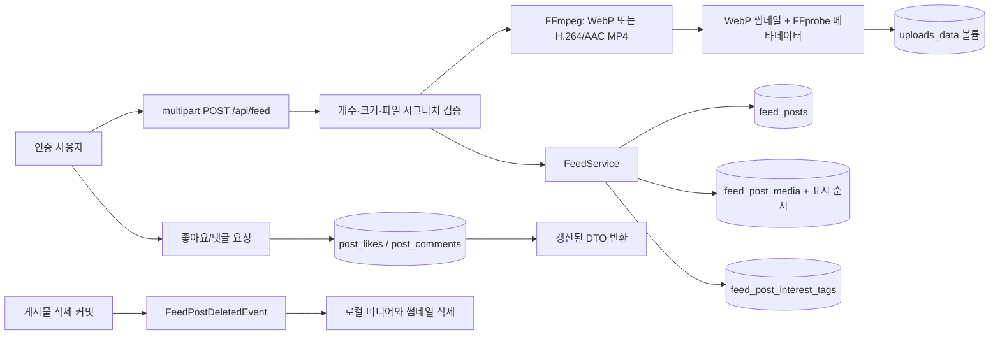
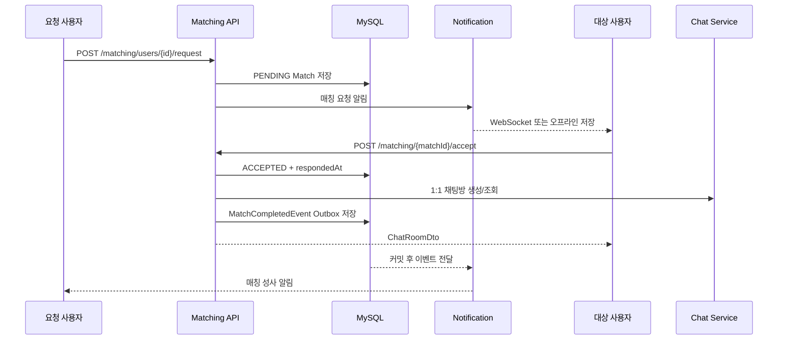
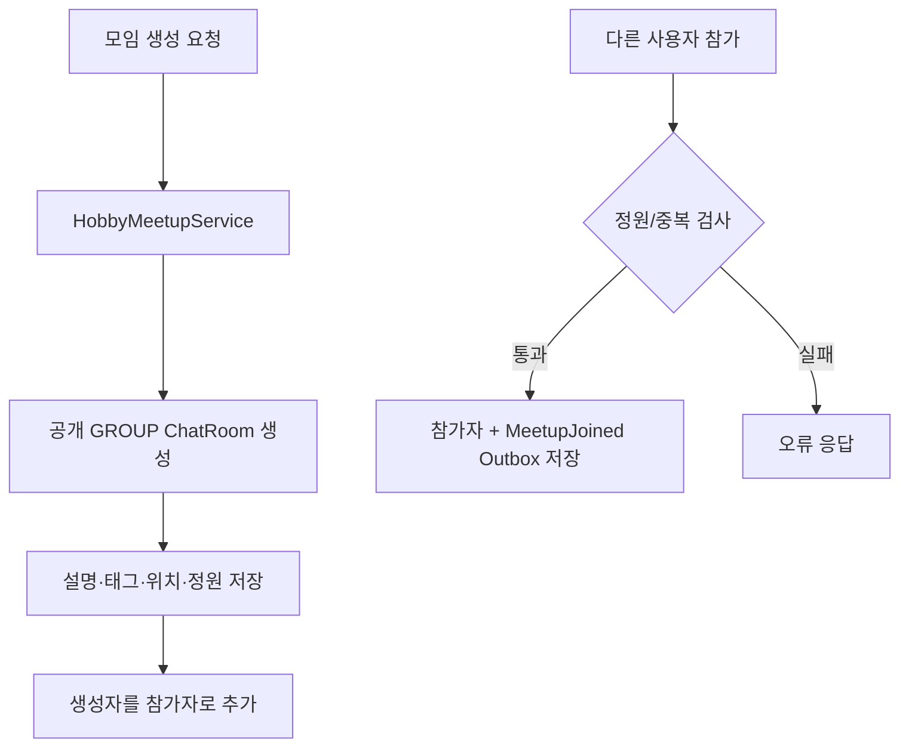
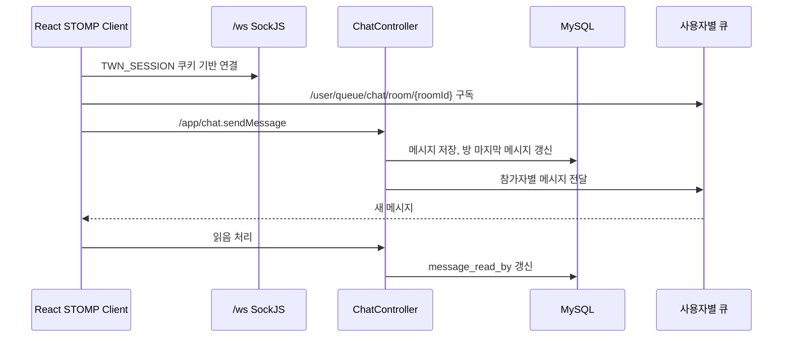
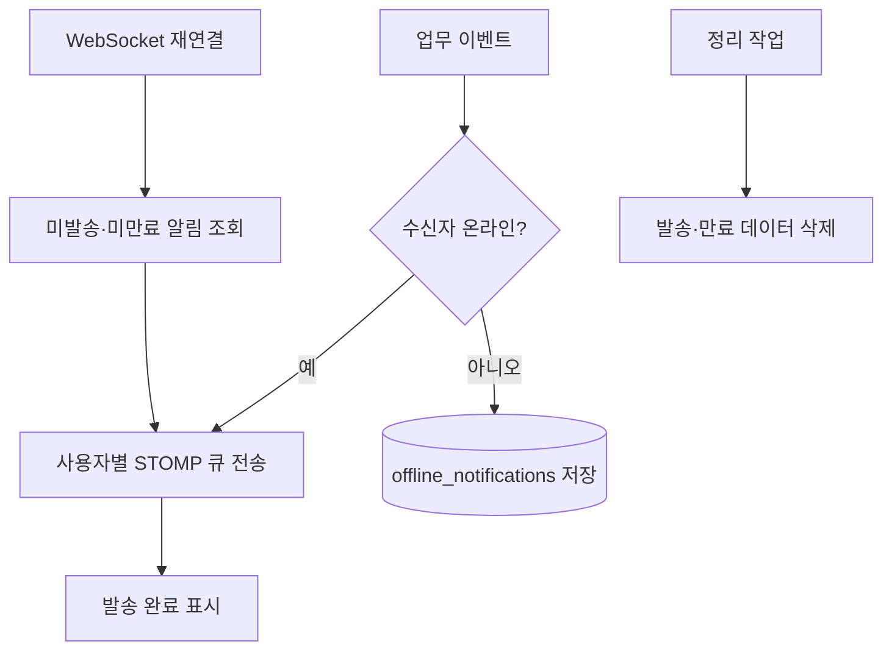

# 데이터 흐름

## 가입과 로그인

```mermaid
sequenceDiagram
    actor User
    participant FE as React
    participant API as Auth API
    participant DB as MySQL
    participant Redis

    User->>FE: 가입 또는 로그인 제출
    FE->>API: POST /api/auth/register 또는 login
    API->>DB: 사용자 조회/저장, 비밀번호 검증
    API->>Redis: session:{uuid} 저장
    API-->>FE: UserDto + TWN_SESSION HttpOnly 쿠키
    FE->>FE: 사용자 상태만 보관; HttpOnly 쿠키 값은 브라우저가 관리
    FE->>API: 이후 동일 출처 요청에 쿠키 자동 첨부
    API->>Redis: 세션 검증
```

현재 세션의 신뢰 기준은 Redis다. 세션이 없거나 만료되면 보호 API는 인증 실패로 처리한다.

## 피드 작성과 반응



## 매칭 요청과 수락



매칭 상태와 채팅방 생성은 같은 트랜잭션에서 처리되고, 후속 알림은 Outbox 이벤트로 분리한다.

## 취미 모임



## 실시간 채팅



REST `POST /api/chat/rooms/{roomId}/messages`도 메시지를 저장할 수 있다. 두 전송 경로의 중복 호출을 피하도록 프론트 전송 정책을 하나로 고정해야 한다.

파일이 있는 메시지는 프론트가 `message` JSON 파트와 `files` 배열을 multipart로 보낸다. 서버는 DB 트랜잭션을 열기 전에 파일을 검증·변환하고, 메시지와 `message_attachments`를 같은 트랜잭션에 저장한다. 커밋된 DTO만 `ChatMessageCommittedEvent`로 참가자에게 전달한다. 저장이 실패하면 새 파일을 즉시 지우고, 방 삭제 시에는 첨부 행과 메시지를 지운 뒤 커밋 후 실제 원본·썸네일을 정리한다.

프로필 사진도 같은 파이프라인을 사용한다. 새 WebP 생성에 성공한 뒤 사용자 레코드를 갱신하며, 트랜잭션 커밋 이후 이전 로컬 사진을 삭제한다.

## 오프라인 알림



재접속 시 프론트는 매칭·채팅·시스템·채팅 갱신 큐를 먼저 구독한 뒤 `/app/client/ready`를 발행한다. 백엔드는 이 준비 신호를 받은 뒤에만 대기 알림을 전달하므로 구독 전 메시지 유실을 피한다.

## 실패와 재시도 원칙

- DB 트랜잭션이 실패하면 해당 업무 변경은 롤백한다.
- WebSocket 전달 실패는 업무 데이터 저장 실패와 구분한다.
- 오프라인 알림은 중복을 확인하고 재시도 횟수를 기록한다.
- 중요 후속 작업은 `outbox_events`에 같은 트랜잭션으로 기록한다.
- 커밋 직후 전달에 실패하거나 프로세스가 종료되면 5초 주기 릴레이가 재시도한다.
- 전달은 최소 1회 방식이므로 소비자는 `eventId`를 기준으로 중복을 견뎌야 한다.
