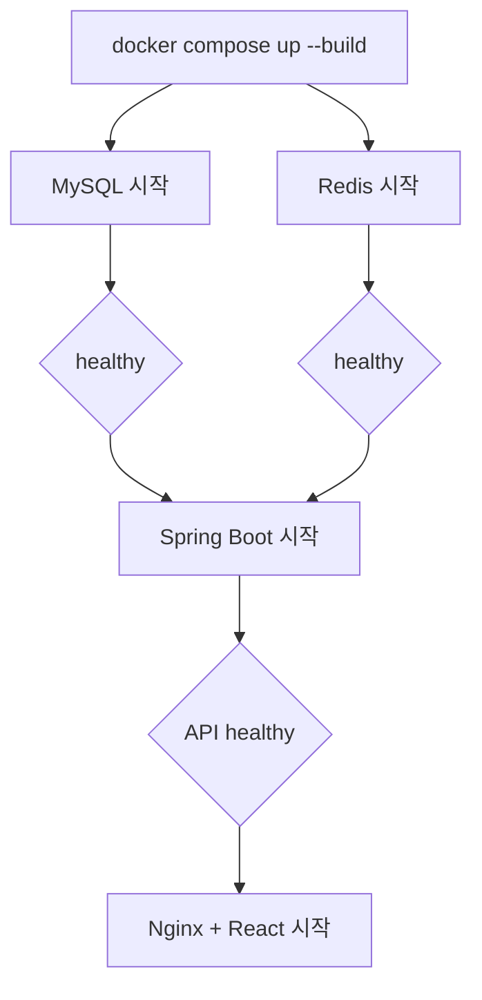

# 실행·배포·CI/CD

## 로컬 풀스택 실행

1. 필요하면 `.env.example`을 참고해 `.env`를 만든다.
2. 프로젝트 루트에서 실행한다.

```bash
docker compose up --build -d
docker compose ps
```

정상 상태에서는 `frontend`, `backend`, `mysql`, `redis`가 모두 `healthy`다.

로그와 종료:

```bash
docker compose logs -f frontend backend
docker compose down
```

데이터 볼륨까지 삭제하는 `docker compose down -v`는 로컬 DB와 Redis 데이터를 제거하므로 의도할 때만 사용한다.

## 컨테이너 흐름



프론트 Nginx는 `/api`와 `/ws`를 `backend:8080`으로 프록시한다. `index.html`은 캐시하지 않고 해시가 붙은 `/assets`만 장기 캐시한다.

## 환경 변수

| 변수 | 목적 |
|---|---|
| `MYSQL_DATABASE` | DB 이름 |
| `MYSQL_USER` | 애플리케이션 DB 사용자 |
| `MYSQL_PASSWORD` | DB 비밀번호 |
| `MYSQL_ROOT_PASSWORD` | MySQL 관리자 비밀번호 |
| `FRONTEND_PORT` | 로컬 프론트 포트, 기본 3000 |
| `BACKEND_PORT` | 로컬 API 포트, 기본 8080 |
| `MYSQL_PORT`, `REDIS_PORT` | 로컬 데이터 서비스 포트 |
| `JWT_SECRET` | 현재 설정 호환용 비밀; 인증 방식 정리 전 이름 재검토 필요 |
| `PUBLIC_ORIGIN` | 운영 CORS 허용 출처 |
| `IMAGE_TAG` | 운영 Compose의 GHCR 태그 |

운영에서는 예제 기본 비밀번호를 절대 사용하지 않는다.

## 프론트 CI/CD

PR과 `main`, `codex/**` 푸시에서 다음을 실행한다.

1. `npm ci`
2. `npm run typecheck`
3. `npm run build`
4. 프로덕션 Docker 이미지 빌드
5. `dist` 아티팩트 보관

`main` 푸시는 GitHub Pages 배포를 실행한다. `main`과 `v*` 태그는 GHCR에 브랜치·태그·SHA·`latest` 이미지를 게시한다.

## 백엔드 CI/CD

PR과 `main`, `codex/**` 푸시에서 다음을 실행한다.

1. Java 17 설정
2. `./gradlew clean test bootJar --no-daemon`
3. `compose.production.yml` 구성 검증
4. 프로덕션 Docker 이미지 빌드
5. 테스트 보고서 보관

`main`과 `v*` 태그는 백엔드 이미지를 GHCR에 게시한다.

## 운영 Compose

백엔드 저장소의 `compose.production.yml`은 다음 이미지를 사용한다.

- `ghcr.io/gituserkhs/talk_with_neighbors_front:${IMAGE_TAG:-latest}`
- `ghcr.io/gituserkhs/talk_with_neighbors_back:${IMAGE_TAG:-latest}`

필수 비밀을 주입한 뒤 실행한다.

```bash
docker compose -f compose.production.yml up -d
```

## 운영 체크리스트

- `latest`만 의존하지 말고 검증된 SHA 또는 릴리스 태그로 배포한다.
- MySQL·Redis는 외부에 공개하지 않는다.
- HTTPS 종단과 보안 쿠키 설정을 적용한다.
- CORS는 실제 프론트 출처만 허용한다.
- DB 백업과 복구 절차를 검증한다.
- 애플리케이션·WebSocket·Redis 지표와 로그를 수집한다.
- 배포 전후 헬스체크와 핵심 사용자 흐름을 스모크 테스트한다.
- DB 스키마 마이그레이션을 애플리케이션 배포와 분리한다.
