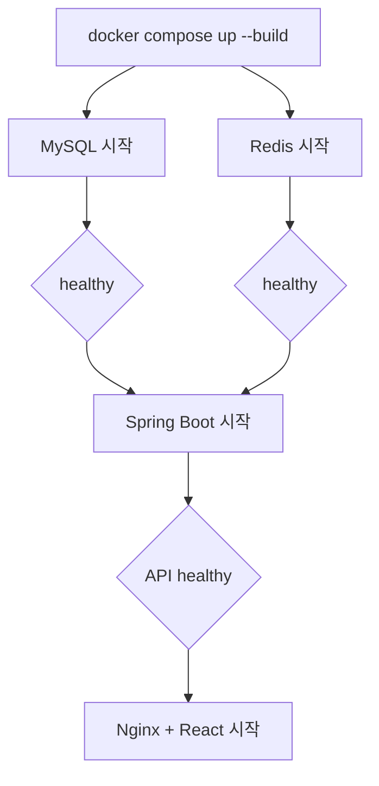

# 실행·배포·CI/CD

## 로컬 풀스택 실행

1. 필요하면 `.env.example`을 참고해 `.env`를 만든다.
2. 프로젝트 루트에서 실행한다.

```bash
docker compose up --build -d
docker compose ps
```

정상 상태에서는 `frontend`, `backend`, `mysql`, `redis`가 모두 `healthy`다.

로그와 종료:

```bash
docker compose logs -f frontend backend
docker compose down
```

데이터 볼륨까지 삭제하는 `docker compose down -v`는 로컬 DB, Redis, 업로드 미디어를 제거하므로 의도할 때만 사용한다.

## 컨테이너 흐름



프론트 Nginx는 `/api`, `/ws`, `/uploads`를 `backend:8080`으로 프록시한다. `index.html`은 캐시하지 않고 해시가 붙은 `/assets`만 장기 캐시한다.

## 환경 변수

| 변수 | 목적 |
|---|---|
| `MYSQL_DATABASE` | DB 이름 |
| `MYSQL_USER` | 애플리케이션 DB 사용자 |
| `MYSQL_PASSWORD` | DB 비밀번호 |
| `MYSQL_ROOT_PASSWORD` | MySQL 관리자 비밀번호 |
| `FRONTEND_PORT` | 로컬 프론트 포트, 기본 3000 |
| `BACKEND_PORT` | 로컬 API 포트, 기본 8080 |
| `MYSQL_PORT`, `REDIS_PORT` | 로컬 데이터 서비스 포트 |
| `APP_MEDIA_STORAGE_DIRECTORY` | 백엔드 미디어 저장 경로; Compose 기본 `/app/uploads` |
| `APP_MEDIA_FFMPEG_COMMAND` | FFmpeg 실행 파일; Docker 기본 `ffmpeg` |
| `APP_MEDIA_FFPROBE_COMMAND` | FFprobe 실행 파일; Docker 기본 `ffprobe` |
| `APP_MEDIA_PROCESSING_TIMEOUT_SECONDS` | probe·변환·썸네일을 합친 한 파일 처리 제한 시간; 기본 90초 |
| `APP_MEDIA_MAX_CONCURRENT_PROCESSES` | 동시 FFmpeg 변환 수; 기본 1, 초과 요청은 잠시 대기 후 503 |
| `APP_MEDIA_MAX_VIDEO_BYTES` | 입력 동영상 한 개의 최대 크기; 기본 30MB(31457280 bytes) |
| `APP_MEDIA_MAX_VIDEO_DURATION_SECONDS` | 입력 동영상 최대 재생 시간; 기본 60초 |
| `APP_MEDIA_MAX_VIDEO_PIXELS` | 입력 동영상 프레임 최대 픽셀 수; 기본 2073600(1920x1080) |
| `APP_MEDIA_MAX_VIDEO_DIMENSION` | 입력 동영상 긴 변의 최대 길이; 기본 1920px, 세로/가로 동일 적용 |
| `PUBLIC_ORIGIN` | 운영 HTTPS CORS origin; 기본 `https://talk-with-neighbors.duckdns.org` |
| `IMAGE_TAG` | 운영 Compose의 GHCR 태그 |

운영에서는 예제 기본 비밀번호를 절대 사용하지 않는다.

백엔드 런타임 이미지는 FFmpeg를 포함한다. 직접 JAR로 실행할 때는 `ffmpeg`와 `ffprobe`가 `PATH`에 있어야 한다. 업로드는 `/app/uploads/.incoming`에 임시 저장한 뒤 변환 성공 파일만 `profile`, `feed`, `chat` 디렉터리에 남긴다. 변환 실패 시 임시·부분 결과를 정리한다.

## 프론트 CI/CD

PR과 `main`, `codex/**` 푸시에서 다음을 실행한다.

1. `npm ci`
2. `npm test`
3. 같은 출처(`/api`, `/ws`) 설정으로 `npm run build`
4. 프로덕션 Docker 이미지 빌드
5. 실제 Nginx 컨테이너 `/healthz`와 SPA 응답 스모크 테스트
6. `dist` 아티팩트 보관

교차 사이트 쿠키 계약과 맞지 않는 GitHub Pages 배포는 제거했다. `main`과 버전 태그의 프론트 이미지는 위 품질 검증을 통과한 뒤 GHCR에 게시되고 AWS의 같은 HTTPS origin에서 제공된다.

## 백엔드 CI/CD

PR과 `main`, `codex/**` 푸시에서 다음을 실행한다.

1. Java 17 설정
2. `./gradlew clean test bootJar --no-daemon`
3. `compose.production.yml` 구성 검증
4. 프로덕션 Docker 이미지 빌드
5. 실제 MySQL 8·Redis 7과 함께 컨테이너 readiness 및 DB 조회 스모크 테스트
6. 테스트 보고서 보관

`main`과 버전 태그의 백엔드 이미지는 별도 품질 작업이 성공한 뒤에만 GHCR에 게시된다. 게시 이미지에는 provenance와 SBOM attestation을 생성한다. 백엔드 `main`의 **Publish backend image**가 성공하면 배포 워크플로가 자동으로 이어지고, 검증을 통과해 승격된 백엔드·프런트엔드 `:main` 태그를 각각 OCI digest로 해석한 뒤 그 불변 주소만 k3s에 전달한다. 실패하거나 취소된 게시 실행은 배포하지 않는다.

백엔드 `main` 게시 성공은 백엔드 저장소 안에서 전체 배포를 시작한다. 프런트 `main` 게시 성공은 최소 권한 GitHub App 토큰으로 백엔드 저장소에 `frontend_image_published` 이벤트를 보낸다. 이 경로는 이벤트의 출처·SHA·run ID와 현재 검증된 프런트 `:main` digest를 다시 확인한 뒤, 기존 k3s의 프런트 Deployment만 교체한다. DB·Redis·백엔드·Kubernetes Secret·migration·백업은 실행하지 않으며, 실제 배포 중인 백엔드 digest와 새 프런트 digest를 릴리스 이력에 기록한다. 늦게 도착한 이벤트도 최신 프런트를 이전 버전으로 되돌리지 않는다.

모임 달력처럼 기존 쓰기를 canonical 데이터로 흡수해야 하는 릴리스는 세 번으로 나눈다. **PR A**에는 호환 백엔드 코드와 테스트만 넣고 migration 파일은 제외한 채 먼저 배포하여 모든 이전 Pod가 교체됐는지 검증한다. 이 버전은 이전 프런트의 프로필 일정 쓰기를 같은 트랜잭션에서 canonical calendar에도 동기화한다. **PR B**는 그 `main` 위에 `V2026071601`과 migration gate·테스트·운영 문서만 추가해 backfill을 실행한다. migration은 후보 방을 `FOR UPDATE`로 잠그고 하나의 트랜잭션에서 변환하므로 이미 배포된 호환 백엔드 쓰기와 경합해도 중간 snapshot을 덮어쓰지 않는다. 마지막으로 새 프런트를 병합·배포한다. PR A와 PR B를 합치면 현재 배포 스크립트가 새 backend rollout보다 migration을 먼저 실행하므로 허용하지 않는다.

## AWS 인프라와 k3s 배포

백엔드 저장소의 `infra/aws-ec2/`는 서울 리전 EC2, VPC, S3, SSM, 비용 알림과 GitHub OIDC 배포·백업 모니터 역할을 관리한다. `deploy/k8s/base/`는 단일 노드 k3s의 MySQL, Redis, 백엔드, 프론트엔드와 Traefik Ingress를 관리하며 미디어 원본과 변환 결과는 비공개 S3 버킷에 저장한다.

2026-07-14 현재 Terraform으로 `t4g.small` EC2와 암호화된 EBS·비공개 S3 리소스를 생성했고, GitHub OIDC와 SSM을 통한 k3s 배포까지 완료했다. 최초 배포에서 VPC와 k3s 기본 Pod CIDR이 `10.42.0.0/16`으로 겹치는 문제를 발견했으나, 보호된 1회 재초기화로 Pod `10.244.0.0/16`, Service `10.96.0.0/16`, DNS `10.96.0.10`으로 이전했다. MySQL 복원, CoreDNS·Traefik, 백엔드·프런트엔드 rollout과 readiness, S3 미디어, 외부 health/API 스모크 테스트를 검증했다. Jackson `2.21.5`와 Logback `1.5.35` 보안 패치를 포함한 최종 이미지도 불변 digest로 재배포했다. 실제 2인 멀티미디어·채팅 E2E는 패치 전후 모두 13단계 291개 assertion과 정리를 통과했고, 10인 동시 부하는 요청 오류·데이터 불일치·WebSocket 유실 0건을 유지하며 워밍업 후 p95 1,477ms를 기록했다. 배포 직후 첫 10인 실행은 p95 2,170ms로 2초 기준을 넘었으므로 작은 단일 노드의 콜드 스타트 특성도 함께 운영 기록으로 남긴다. `K3S_NETWORK_REINITIALIZE_ALLOWED`는 다시 `false`로 잠갔고 일반 배포는 `reinitialize_k3s_network=false`로만 수행한다. 현재 리소스는 비용이 발생할 수 있다.

`infra-ci.yml`은 Terraform 형식·스키마와 VPC·Pod·Service CIDR 비중첩, Kustomize 렌더링, Kubernetes 스키마, GitHub Actions 문법, 백업·복원·릴리스 이력 계약을 검증하지만 비용이 발생하는 `terraform apply`는 실행하지 않는다. `deploy-k3s.yml`의 전체 배포는 `main` 전용 `production` Environment에서 고정된 GHCR digest만 받아 SSM으로 실행한다. 프런트 이벤트는 같은 branch·Environment gate를 거치되 기존 프런트 Deployment만 바꾸고, 백엔드 게시와 수동 배포·롤백만 전체 배포 경로를 사용한다. 현재 `production`에는 Required reviewer가 없어 `main` 게시 뒤 자동으로 이어진다. migration 전에는 별도 비공개 S3 버킷에 MySQL 논리 백업을 만들고 업로드 메타데이터와 체크섬을 검증한다. 성공한 백엔드·프런트엔드 digest 조합은 S3에 기록하며, 수동 워크플로에서 최신 또는 직전 성공 조합을 선택해 DB downgrade 없이 재배포할 수 있다. 롤백은 migration과 Hibernate 자동 스키마 변경을 모두 끈다. systemd timer가 일일 백업과 주간 격리 스키마 복원 검증을 수행하고, 승인자가 없는 `production-monitor` Environment와 전용 최소 권한 OIDC 역할을 쓰는 `monitor-mysql-backup.yml`이 상태 신선도를 감시한다. 자동 전체 CD는 중지된 인스턴스를 시작한 뒤 Terraform 관리 Elastic IP와 DuckDNS A 레코드가 일치할 때만 Traefik ACME PVC, HTTP→HTTPS redirect, TLS Ingress를 적용하고 외부 HTTPS API를 검증한다. 기본 origin은 `https://talk-with-neighbors.duckdns.org`이며 세션 쿠키도 `Secure`로 설정된다. 네트워크 재초기화는 자동 CD에서 항상 비활성화되고 수동 비상 절차에서만 다중 확인 게이트를 요구한다. SSH 22는 열지 않는다. 자세한 생성·TLS 전환·비용 관리·백업·롤백 절차는 [AWS EC2 + S3 + k3s 배포 가이드](deployment/aws-k3s.md)를 따른다.

## 참고용 운영 Compose

백엔드 저장소의 `compose.production.yml`은 다음 이미지를 사용한다.

- `ghcr.io/gituserkhs/talk_with_neighbors_front:${IMAGE_TAG:-latest}`
- `ghcr.io/gituserkhs/talk_with_neighbors_back:${IMAGE_TAG:-latest}`

이 구성은 Kubernetes 없이 한 서버에서 GHCR 이미지를 점검할 때 사용할 수 있다. 업로드 미디어도 `media_data` 볼륨에 보존하지만, 새 배포는 SHA 태그를 명시하고 HTTPS·백업을 별도로 준비해야 한다.

```bash
docker compose -f compose.production.yml up -d
```

## 운영 체크리스트

- `latest`만 의존하지 말고 검증된 SHA 또는 릴리스 태그로 배포한다.
- MySQL·Redis는 외부에 공개하지 않는다.
- HTTPS 종단, 인증서 자동 갱신과 보안 쿠키를 계속 검증한다.
- CORS는 실제 프론트 출처만 허용한다.
- DB 백업과 복구 절차를 검증한다.
- 애플리케이션·WebSocket·Redis 지표와 로그를 수집한다.
- 배포 전후 헬스체크와 핵심 사용자 흐름을 스모크 테스트한다.
- DB 스키마 마이그레이션을 애플리케이션 배포와 분리한다.
