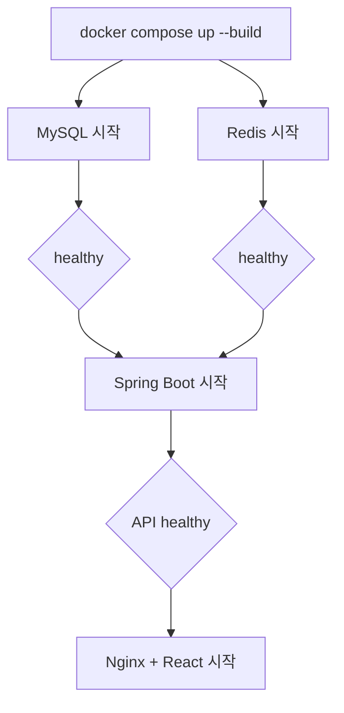

# 실행·배포·CI/CD

## 로컬 풀스택 실행

1. 필요하면 `.env.example`을 참고해 `.env`를 만든다.
2. 프로젝트 루트에서 실행한다.

```bash
docker compose up --build -d
docker compose ps
```

정상 상태에서는 `frontend`, `backend`, `mysql`, `redis`가 모두 `healthy`다.

로그와 종료:

```bash
docker compose logs -f frontend backend
docker compose down
```

데이터 볼륨까지 삭제하는 `docker compose down -v`는 로컬 DB, Redis, 업로드 미디어를 제거하므로 의도할 때만 사용한다.

## 컨테이너 흐름



프론트 Nginx는 `/api`, `/ws`, `/uploads`를 `backend:8080`으로 프록시한다. `index.html`은 캐시하지 않고 해시가 붙은 `/assets`만 장기 캐시한다.

## 환경 변수

| 변수 | 목적 |
|---|---|
| `MYSQL_DATABASE` | DB 이름 |
| `MYSQL_USER` | 애플리케이션 DB 사용자 |
| `MYSQL_PASSWORD` | DB 비밀번호 |
| `MYSQL_ROOT_PASSWORD` | MySQL 관리자 비밀번호 |
| `FRONTEND_PORT` | 로컬 프론트 포트, 기본 3000 |
| `BACKEND_PORT` | 로컬 API 포트, 기본 8080 |
| `MYSQL_PORT`, `REDIS_PORT` | 로컬 데이터 서비스 포트 |
| `JWT_SECRET` | 현재 설정 호환용 비밀; 인증 방식 정리 전 이름 재검토 필요 |
| `APP_MEDIA_STORAGE_DIRECTORY` | 백엔드 미디어 저장 경로; Compose 기본 `/app/uploads` |
| `APP_MEDIA_FFMPEG_COMMAND` | FFmpeg 실행 파일; Docker 기본 `ffmpeg` |
| `APP_MEDIA_FFPROBE_COMMAND` | FFprobe 실행 파일; Docker 기본 `ffprobe` |
| `APP_MEDIA_PROCESSING_TIMEOUT_SECONDS` | 한 파일 변환 제한 시간; 기본 180초 |
| `APP_MEDIA_MAX_CONCURRENT_PROCESSES` | 동시 FFmpeg 변환 수; 기본 2, 초과 요청은 잠시 대기 후 503 |
| `PUBLIC_ORIGIN` | 운영 CORS 허용 출처 |
| `IMAGE_TAG` | 운영 Compose의 GHCR 태그 |

운영에서는 예제 기본 비밀번호를 절대 사용하지 않는다.

백엔드 런타임 이미지는 FFmpeg를 포함한다. 직접 JAR로 실행할 때는 `ffmpeg`와 `ffprobe`가 `PATH`에 있어야 한다. 업로드는 `/app/uploads/.incoming`에 임시 저장한 뒤 변환 성공 파일만 `profile`, `feed`, `chat` 디렉터리에 남긴다. 변환 실패 시 임시·부분 결과를 정리한다.

## 프론트 CI/CD

PR과 `main`, `codex/**` 푸시에서 다음을 실행한다.

1. `npm ci`
2. `npm test`
3. 같은 출처(`/api`, `/ws`) 설정으로 `npm run build`
4. 프로덕션 Docker 이미지 빌드
5. 실제 Nginx 컨테이너 `/healthz`와 SPA 응답 스모크 테스트
6. `dist` 아티팩트 보관

GitHub Pages는 공개 API 주소를 명시해야 하는 수동 미리보기다. `main`과 버전 태그의 프론트 이미지는 위 품질 검증을 통과한 뒤 GHCR에 게시된다.

## 백엔드 CI/CD

PR과 `main`, `codex/**` 푸시에서 다음을 실행한다.

1. Java 17 설정
2. `./gradlew clean test bootJar --no-daemon`
3. `compose.production.yml` 구성 검증
4. 프로덕션 Docker 이미지 빌드
5. 실제 MySQL 8·Redis 7과 함께 컨테이너 readiness 및 DB 조회 스모크 테스트
6. 테스트 보고서 보관

`main`과 버전 태그의 백엔드 이미지는 별도 품질 작업이 성공한 뒤에만 GHCR에 게시된다. 게시 이미지에는 provenance와 SBOM attestation을 생성한다.

## AWS 인프라와 k3s 배포

백엔드 저장소의 `infra/aws-ec2/`는 서울 리전 EC2, VPC, S3, SSM, 비용 알림과 GitHub OIDC 배포 역할을 관리한다. `deploy/k8s/base/`는 단일 노드 k3s의 MySQL, Redis, 백엔드, 프론트엔드와 Traefik Ingress를 관리하며 미디어 원본과 변환 결과는 비공개 S3 버킷에 저장한다.

2026-07-14 현재 Terraform으로 `t4g.small` EC2와 암호화된 EBS·비공개 S3 리소스를 생성했고, GitHub OIDC와 SSM을 통한 k3s 배포까지 완료했다. 최초 배포에서 VPC와 k3s 기본 Pod CIDR이 `10.42.0.0/16`으로 겹치는 문제를 발견했으나, 보호된 1회 재초기화로 Pod `10.244.0.0/16`, Service `10.96.0.0/16`, DNS `10.96.0.10`으로 이전했다. MySQL 복원, CoreDNS·Traefik, 백엔드·프런트엔드 rollout과 readiness, S3 미디어, 외부 health/API 스모크 테스트를 검증했다. Jackson `2.21.5`와 Logback `1.5.35` 보안 패치를 포함한 최종 이미지도 불변 digest로 재배포했다. 실제 2인 멀티미디어·채팅 E2E는 패치 전후 모두 13단계 291개 assertion과 정리를 통과했고, 10인 동시 부하는 요청 오류·데이터 불일치·WebSocket 유실 0건을 유지하며 워밍업 후 p95 1,477ms를 기록했다. 배포 직후 첫 10인 실행은 p95 2,170ms로 2초 기준을 넘었으므로 작은 단일 노드의 콜드 스타트 특성도 함께 운영 기록으로 남긴다. `K3S_NETWORK_REINITIALIZE_ALLOWED`는 다시 `false`로 잠갔고 일반 배포는 `reinitialize_k3s_network=false`로만 수행한다. 현재 리소스는 비용이 발생할 수 있다.

`infra-ci.yml`은 Terraform 형식·스키마와 VPC·Pod·Service CIDR 비중첩, Kustomize 렌더링, Kubernetes 스키마, GitHub Actions 문법을 검증하지만 비용이 발생하는 `terraform apply`는 실행하지 않는다. `deploy-k3s.yml`은 승인된 `production` Environment에서 고정된 GHCR digest만 받아 임시 S3 번들과 SSM Run Command로 배포하고 rollout·readiness·외부 API를 확인한다. 네트워크 재초기화는 `main`, `production`, Environment 토글, boolean 입력, 인스턴스별 확인 문구를 모두 요구하며 성공 후 다시 비활성화한다. SSH 22는 열지 않는다. 자세한 생성·1회 복구·비용 관리·롤백·삭제 절차는 [AWS EC2 + S3 + k3s 배포 가이드](deployment/aws-k3s.md)를 따른다.

## 참고용 운영 Compose

백엔드 저장소의 `compose.production.yml`은 다음 이미지를 사용한다.

- `ghcr.io/gituserkhs/talk_with_neighbors_front:${IMAGE_TAG:-latest}`
- `ghcr.io/gituserkhs/talk_with_neighbors_back:${IMAGE_TAG:-latest}`

이 구성은 Kubernetes 없이 한 서버에서 GHCR 이미지를 점검할 때 사용할 수 있다. 업로드 미디어도 `media_data` 볼륨에 보존하지만, 새 배포는 SHA 태그를 명시하고 HTTPS·백업을 별도로 준비해야 한다.

```bash
docker compose -f compose.production.yml up -d
```

## 운영 체크리스트

- `latest`만 의존하지 말고 검증된 SHA 또는 릴리스 태그로 배포한다.
- MySQL·Redis는 외부에 공개하지 않는다.
- HTTPS 종단과 보안 쿠키 설정을 적용한다.
- CORS는 실제 프론트 출처만 허용한다.
- DB 백업과 복구 절차를 검증한다.
- 애플리케이션·WebSocket·Redis 지표와 로그를 수집한다.
- 배포 전후 헬스체크와 핵심 사용자 흐름을 스모크 테스트한다.
- DB 스키마 마이그레이션을 애플리케이션 배포와 분리한다.
