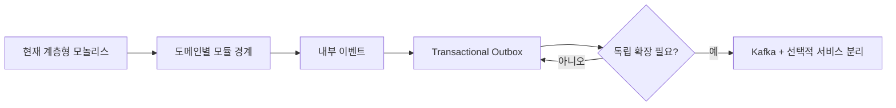

# 아키텍처 발전 계획

## 권장 방향

현재 단계에서는 마이크로서비스보다 **모듈형 모놀리스 + 명시적 도메인 이벤트**가 적합하다. 내부 이벤트와 Transactional Outbox의 첫 구현은 완료됐다.



## 1단계: 모듈 경계 정리

다음과 같은 도메인 중심 패키지로 이동한다.

```text
com.talkwithneighbors
├─ auth
├─ feed
├─ matching
├─ meetup
├─ chat
├─ notification
└─ shared
```

각 모듈은 공개 애플리케이션 서비스 또는 이벤트를 통해서만 다른 모듈과 통신하고, 다른 모듈의 Repository를 직접 사용하지 않는 것을 목표로 한다.

## 2단계: 내부 도메인 이벤트

구현됨: `MatchCompletedEvent`, `MeetupJoinedEvent`, 타입 기반 역직렬화와 알림 소비자.

우선 Spring 내부 이벤트로 다음 계약을 정의한다.

| 이벤트 | 발행 시점 | 예상 소비자 |
|---|---|---|
| `UserRegistered` | 가입 완료 | 알림, 분석 |
| `ProfileUpdated` | 위치·관심사 변경 | 추천 인덱스 |
| `FeedPostCreated` | 게시물 커밋 완료 | 알림, 피드 분석 |
| `MatchRequested` | 매칭 요청 저장 | 알림 |
| `MatchAccepted` | 수락 완료 | 채팅방, 알림 |
| `MeetupJoined` | 모임 참가 완료 | 알림, 정원 통계 |
| `ChatMessageCreated` | 메시지 저장 완료 | WebSocket, 오프라인 알림 |

이벤트에는 `eventId`, `eventType`, `aggregateId`, `occurredAt`, `schemaVersion`, `payload`를 포함한다.

## 3단계: Transactional Outbox

구현됨: 같은 트랜잭션 저장, 커밋 후 전달, 5초 재시도, 비관적 잠금, 실패 횟수·오류 기록, 7일 보존 정리.

중요한 DB 변경과 이벤트 기록을 같은 트랜잭션에서 처리한다.

```text
outbox_events
- id
- event_type
- aggregate_type
- aggregate_id
- payload_json
- schema_version
- occurred_at
- published_at
- retry_count
```

소비자는 이벤트 ID를 저장하거나 멱등 키로 사용해 중복 처리를 견뎌야 한다.

## Kafka 도입 기준

다음 조건 중 여러 개가 실제로 발생할 때 도입을 검토한다.

- 채팅·알림 이벤트 처리량이 단일 인스턴스 처리량을 지속적으로 초과한다.
- 추천·분석 등 여러 소비자가 같은 이벤트를 독립적으로 재생해야 한다.
- 장애 시 이벤트를 장기간 보관하고 재처리해야 한다.
- 특정 기능을 독립 배포·확장해야 할 명확한 조직적 이유가 있다.
- Outbox와 내부 비동기 처리만으로 요구 지연시간이나 안정성을 만족하지 못한다.

## Kafka 도입 시 초안

| 토픽 | 키 | 생산자 | 소비자 |
|---|---|---|---|
| `user.lifecycle.v1` | userId | 인증 | 알림, 분석 |
| `feed.events.v1` | postId | 피드 | 알림, 추천 |
| `matching.events.v1` | matchId | 매칭 | 채팅, 알림 |
| `chat.messages.v1` | roomId | 채팅 | WebSocket 게이트웨이, 알림 |
| `notification.commands.v1` | userId | 각 도메인 | 알림 처리기 |

파티션 키는 순서가 필요한 단위를 기준으로 선택한다. 채팅은 `roomId`, 사용자 알림은 `userId`가 적합하다.

## 가장 먼저 분리할 후보

1. **알림 워커**: 실패 격리와 비동기 재처리 효과가 크다.
2. **실시간 게이트웨이**: WebSocket 연결 수에 따라 독립 확장이 필요할 수 있다.
3. **추천·분석**: 비동기 데이터 소비와 재처리에 적합하다.

인증·피드·모임은 데이터 트랜잭션이 안정될 때까지 모놀리스에 유지하는 편이 안전하다.

## 선행 과제

- 이벤트 소비자별 멱등 처리 기록 강화
- 테스트용 알림 엔드포인트 보호 또는 제거
- 완료: 사용하지 않는 JWT 설정과 배포 Secret을 제거하고 HttpOnly 쿠키 기반 세션 인증으로 통일
- Flyway/Liquibase 도입
- 구조화 로그, 추적 ID, 메트릭 도입
- 핵심 흐름 통합·브라우저 스모크 테스트 추가
- 이벤트 스키마 버전 정책과 개인정보 최소화 규칙 정의
