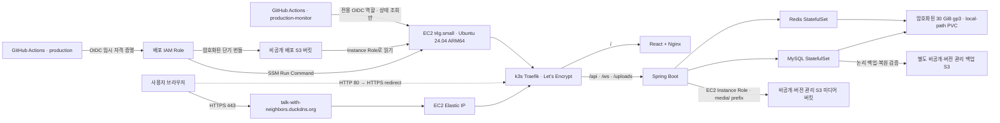

# AWS EC2 + S3 + 단일 노드 k3s 배포 가이드

이 문서는 `talk_with_neighbors`를 서울 리전의 저비용 AWS 환경에 배포하는 절차를 설명한다. 대상은 실제 상용 서비스가 아니라 **DevOps·백엔드 포트폴리오와 짧은 데모**다. 관리형 EKS 대신 ARM64 EC2 한 대의 k3s를 사용하고, 미디어만 비공개 S3로 분리한다.

> **현재 상태 — 2026-07-15:** `talk-with-neighbors.duckdns.org`용 Elastic IP, Traefik HTTP-01 인증서 자동 발급·갱신과 HTTP→HTTPS 전환, 실제 E2E 검증을 완료했다. DB migration gate, 별도 S3 논리 백업과 복원 검증, 불변 digest 릴리스 이력, 프런트 단독 배포와 전용 백업 모니터 OIDC 역할도 코드로 관리한다. **Elastic IP를 포함한 AWS 리소스는 비용이 발생할 수 있다.**

이 구성은 고가용성이나 무중단 배포를 보장하지 않는다. 자동 논리 백업과 동일 노드 격리 복원 시험은 제공하지만, 노드 전체 상실을 가정한 별도 복원 훈련과 관리형 DB 수준의 재해 복구를 대신하지 않는다.

## 1. 선택한 구조



| 구성 요소 | 현재 선택 | 이유와 한계 |
|---|---|---|
| 컴퓨트 | `t4g.small`, 2 vCPU·2 GiB, ARM64 | 저비용 포트폴리오 기본값. k3s·JVM·MySQL·Redis를 한 노드에서 돌리므로 2 GiB swap과 보수적인 컨테이너 제한을 사용한다. |
| 루트 디스크 | 암호화된 30 GiB gp3 | k3s 이미지·로그·MySQL PVC를 함께 저장한다. EC2를 중지해도 유지되고 과금될 수 있으며, 인스턴스 종료 시 삭제된다. |
| 오케스트레이션 | 단일 노드 k3s + Traefik | EKS 제어부 비용을 피하지만 노드 장애가 곧 전체 서비스 장애다. |
| 미디어 | 비공개·버전 관리 S3 | 앱이 `/uploads/**`로 프록시한다. 브라우저에 버킷이나 AWS 키를 노출하지 않는다. |
| DB 백업 | 별도 비공개·버전 관리 S3 + systemd timer | migration 전과 매일 논리 백업을 만들고 주간 격리 복원 시험을 수행한다. 노드 역할에는 백업 삭제 권한을 주지 않는다. |
| 배포 | GitHub OIDC → S3 번들 → SSM | 장기 AWS 액세스 키와 SSH 22 포트를 사용하지 않는다. |
| 네트워크 | Public subnet + Internet Gateway + Elastic IP | 포트폴리오 URL을 고정한다. Load Balancer와 NAT Gateway 비용은 피하지만 Elastic IP는 중지 중에도 과금된다. |
| 클러스터 CIDR | VPC `10.42.0.0/16`, Pod `10.244.0.0/16`, Service `10.96.0.0/16`, DNS `10.96.0.10` | VPC·Pod·Service 대역을 서로 겹치지 않게 고정한다. Terraform plan 단계에서 subnet 포함 관계와 CIDR 중첩을 거부한다. |
| 외부 프로토콜 | HTTPS 443, HTTP 80 redirect·ACME | Traefik이 HTTP-01로 인증서를 갱신하고 ACME 상태를 local-path PVC에 보존한다. |

S3 Gateway VPC Endpoint를 사용해 EC2와 S3 사이 경로에 NAT Gateway가 필요하지 않다. Gateway 유형 자체에는 시간당 엔드포인트 요금이 없지만 S3 저장·요청·인터넷 전송 요금은 별도다.

## 2. Terraform이 만드는 리소스

`infra/aws-ec2/`는 다음을 관리한다.

- 전용 VPC, Public subnet 한 개, Internet Gateway, Route Table
- 시간당 요금이 없는 S3 Gateway VPC Endpoint
- 80·443만 인바운드로 허용하고 22는 열지 않는 Security Group
- Canonical Ubuntu 24.04 ARM64 AMI의 `t4g.small` EC2
- EC2 중지·시작 후에도 유지되는 VPC Elastic IP
- 암호화·종료 시 삭제되는 30 GiB gp3 루트 볼륨
- 2 GiB swap, 고정된 k3s 버전, secrets encryption을 설정하는 최초 부팅 스크립트
- VPC·Pod·Service CIDR의 비중첩과 public subnet 포함 관계를 적용 전 차단하는 Terraform precondition
- Pod `10.244.0.0/16`, Service `10.96.0.0/16`, cluster DNS `10.96.0.10`을 명시한 k3s 네트워크 설정
- SSM 관리 권한과 `media/`·`deployments/` 및 전용 백업 버킷의 `mysql/` prefix만 허용하는 EC2 Instance Role
- 공개 접근 차단, SSE-S3, TLS 외 접근 거부를 적용한 미디어·배포·MySQL 백업 버킷
- 미디어 버킷 버전 관리와 비현재 버전 기본 30일 보존
- MySQL 백업 버킷 버전 관리, 기본 30일 보존, Terraform 삭제 방지와 EC2 역할의 객체 삭제 권한 제외
- 배포 번들을 하루 뒤 정리하고 성공한 불변 digest 조합은 기본 90일 보존하는 S3 lifecycle
- GitHub `production` Environment subject만 신뢰하는 OIDC 배포 Role
- GitHub `production-monitor` Environment subject만 신뢰하고 대상 EC2의 SSM 상태 조회에만 쓰는 OIDC 모니터 Role
- 이메일을 지정했을 때만 생성되는 월 비용 Budget

미디어와 배포 버킷은 기본적으로 `force_destroy = false`다. 실수로 Terraform을 실행해도 비어 있지 않은 버킷을 즉시 삭제하지 못하게 하는 보호 장치다.

## 3. 비용과 Free Tier

2025년 7월 15일 이후 만든 신규 계정은 가입 시 USD 100 크레딧을 받고 활동 완료로 최대 USD 100를 추가로 받을 수 있다. Free account plan은 계정 생성 후 6개월 또는 크레딧 소진 중 먼저 오는 시점까지다. `t4g.small`과 gp3는 신규 계정의 Free Tier eligible 목록에 있지만, **eligible은 모든 사용량이 영구 무료라는 뜻이 아니다.** 계정 plan, 남은 크레딧, AMI와 리전 조건을 Billing 화면에서 직접 확인한다.

2026-07-14 현재 AWS의 T4g 안내에는 `t4g.small`을 2026-12-31까지 월 최대 750시간 시험할 수 있다고도 명시되어 있다. 이 혜택이 계정과 선택한 Ubuntu AMI에 실제 적용되는지는 EC2 생성 화면과 청구서에서 확인한다. 컴퓨트 혜택이 적용되어도 EBS, S3, Public IPv4, snapshot, 초과 데이터 전송이 자동으로 모두 무료가 되는 것은 아니다.

- [신규 AWS Free Tier 안내](https://docs.aws.amazon.com/awsaccountbilling/latest/aboutv2/free-tier.html)
- [EC2 Free Tier 대상과 사용량 확인](https://docs.aws.amazon.com/AWSEC2/latest/UserGuide/ec2-free-tier-usage.html)
- [EC2 T4g 사양과 기간 한정 시험 안내](https://aws.amazon.com/ec2/instance-types/t4/)
- [EC2 On-Demand 가격](https://aws.amazon.com/ec2/pricing/on-demand/)
- [EBS 가격](https://aws.amazon.com/ebs/pricing/)
- [S3 가격](https://aws.amazon.com/s3/pricing/)
- [Public IPv4 과금 설명](https://docs.aws.amazon.com/vpc/latest/userguide/what-is-amazon-vpc.html)

가격은 리전·계정 혜택·세금·환율에 따라 바뀌므로 문서에 고정 월액을 약속하지 않는다. 적용 직전 [AWS Pricing Calculator](https://calculator.aws/)로 서울 리전의 현재 단가를 다시 계산한다.

| 비용 항목 | 언제 비용이 생기는가 | 절약 방법 |
|---|---|---|
| EC2 compute | 인스턴스가 `running`인 시간 | 데모할 때만 시작하고 끝나면 중지한다. `t4g.small` CPU credit은 `standard`로 고정해 unlimited 추가 요금을 피한다. |
| Public IPv4 / Elastic IP | 실행 여부와 관계없이 할당된 공인 IPv4 사용 시간. 계정 혜택 적용 여부는 Billing에서 확인한다. | 장기간 데모를 닫을 때는 Terraform으로 Elastic IP까지 해제해야 과금이 멈춘다. |
| EBS gp3 | 30 GiB 볼륨이 존재하는 동안. EC2를 중지해도 계속 존재한다. | 이미지·로그를 정리하고 필요 없으면 `terraform destroy`로 종료한다. |
| S3 미디어 | 현재 객체와 보존 중인 비현재 버전의 GB-month, PUT·GET·LIST, 인터넷 전송 | 비현재 버전은 기본 30일 뒤 만료한다. 큰 테스트 파일과 불필요한 현재 객체는 직접 삭제한다. |
| S3 배포 번들 | 배포할 때의 짧은 저장·요청 | 성공·실패 시 스크립트가 삭제하고, 누락된 객체도 하루 뒤 lifecycle로 만료한다. |
| 스냅샷·데이터 전송 | 수동 EBS snapshot, 인터넷 outbound 등 | 스냅샷 보존 기한을 정하고 Billing에서 전송량을 확인한다. |
| AWS Budget | 이메일을 지정했을 때 월 Budget 생성 | 알림은 지출을 차단하지 않는다. 실제 사용 중지·삭제는 별도로 해야 한다. |

`budget_alert_email`을 설정하면 기본 USD 10 월 Budget에서 실제 80%, 예측 100% 알림을 보낸다. 크레딧이 있어도 **Billing → Credits, Free Tier, Bills, Cost Explorer**를 함께 확인한다.

## 4. 사전 준비

다음이 필요하다.

- AWS CLI v2와 Terraform `>= 1.10, < 2.0` (CI와 현재 운영 검증 버전은 `1.14.6`)
- 서울 리전에서 VPC, EC2, EBS, S3, IAM, SSM, Budget을 만들 수 있는 로컬 AWS 주체
- 백엔드 GitHub 저장소 관리자 권한
- GHCR에 게시된 ARM64 포함 다중 아키텍처 백엔드·프론트엔드 이미지
- GitHub 저장소의 Environment와 branch policy를 관리할 계정

루트 사용자의 장기 액세스 키는 만들지 않는다. 로컬 CLI는 가능한 한 AWS IAM Identity Center나 수명이 짧은 관리자 세션을 사용하고, 먼저 대상 계정을 확인한다.

```powershell
aws sts get-caller-identity
aws configure get region
terraform version
```

출력의 AWS Account ID와 ARN이 의도한 포트폴리오 계정인지 확인한다. 다른 계정이면 여기서 멈춘다.

## 5. 과금 없이 검증하기

저장소의 인프라 CI는 `terraform apply`를 호출하지 않는다. PR에서 다음을 검증한다.

- Terraform `fmt`, provider 초기화, `validate`
- Kustomize 렌더링과 kubeconform Kubernetes 스키마 검사
- 배포 Bash의 ShellCheck
- GitHub Actions의 actionlint

로컬에서도 먼저 정적 검증과 mock 기반 기본값 테스트를 실행할 수 있다.

```powershell
Set-Location infra\aws-ec2
terraform init -backend=false -input=false
terraform fmt -check -recursive
terraform validate
terraform test
```

`terraform init`은 provider를 내려받지만 AWS 리소스를 만들지 않는다. 실제 계정 조회와 생성 계획은 다음 절의 `plan`부터 시작한다.

## 6. Terraform 계획과 최초 생성

### 6.1 변수 준비

백엔드 저장소 루트에서 실행한다.

```powershell
Set-Location infra\aws-ec2
Copy-Item terraform.tfvars.example terraform.tfvars
```

기본 예시는 다음 선택을 담고 있다.

```hcl
aws_region        = "ap-northeast-2"
availability_zone = "ap-northeast-2a"

vpc_cidr           = "10.42.0.0/16"
public_subnet_cidr = "10.42.1.0/24"
k3s_cluster_cidr   = "10.244.0.0/16"
k3s_service_cidr   = "10.96.0.0/16"
k3s_cluster_dns    = "10.96.0.10"

instance_type        = "t4g.small"
root_volume_size_gib = 30
k3s_version          = "v1.34.8+k3s1"

# 삭제된 미디어의 비현재 버전을 약 30일 동안만 복구 가능하게 유지한다.
media_noncurrent_version_expiration_days = 30
media_bucket_force_destroy                = false

github_owner       = "gitUserKHS"
github_repository  = "talk_with_neighbors_back"
github_environment = "production"
application_domain = "talk-with-neighbors.duckdns.org"

# 선택: 월 USD 10 Budget과 이메일 알림
budget_alert_email = "you@example.com"
monthly_budget_usd = 10
```

계정에 `https://token.actions.githubusercontent.com` OIDC provider가 이미 있으면 새로 만들지 않도록 기존 ARN을 넣는다.

```hcl
github_oidc_provider_arn = "arn:aws:iam::123456789012:oidc-provider/token.actions.githubusercontent.com"
```

`terraform.tfvars`, `backend.hcl`, `*.tfstate*`, `tfplan`은 커밋하지 않는다. 운영 state는 애플리케이션 리소스와 수명을 분리한 전용 S3 버킷에 저장한다. 부트스트랩 버킷은 CloudFormation의 `DeletionPolicy: Retain`으로 보호되고, 버전 관리·AES256 기본 암호화·공개 차단·TLS 강제가 적용된다. S3 native lockfile을 사용하므로 Terraform 1.10 이상이 필요하다.

새 계정에서는 Terraform 본 스택보다 먼저 전용 backend 스택을 한 번 배포한다. 아래 명령은 앞에서 이동한 `infra/aws-ec2` 디렉터리를 기준으로 저장소 루트에 잠시 다녀온다. CloudFormation이 부트스트랩 상태를 관리하므로 아직 존재하지 않는 자기 backend를 Terraform으로 만들려는 순환 의존성이 없다.

```powershell
$AccountId = aws sts get-caller-identity --query Account --output text
$StateBucket = "talk-with-neighbors-tfstate-$AccountId"

Push-Location ..\..
aws cloudformation deploy `
  --stack-name talk-with-neighbors-terraform-state `
  --template-file infra/aws-bootstrap/terraform-state.yaml `
  --parameter-overrides StateBucketName=$StateBucket `
  --region ap-northeast-2
Pop-Location
```

그다음 예시 파일을 복사하고 `ACCOUNT_ID`를 실제 12자리 계정 ID로 바꾼다. `backend.hcl`은 계정별 파일이라 Git에서 무시된다.

```powershell
Copy-Item backend.hcl.example backend.hcl
terraform init -reconfigure -backend-config=backend.hcl -input=false
```

현재 계정 `420588757414`의 기준 backend는 `talk-with-neighbors-tfstate-420588757414` 버킷과 `talk-with-neighbors/production/terraform.tfstate` key다. 2026-07-14에 기존 state를 전용 버킷으로 복사하고 실제 AWS와 `No changes` plan으로 대조했다. 기존 state를 새 local state로 덮어쓰거나, 검증 없이 `-migrate-state`를 실행하지 않는다. state와 `.tflock`의 비현재 버전은 365일 보존하므로 복구 가능성과 비용을 함께 제한한다.

### 6.2 계획 검토

```powershell
terraform init -reconfigure -backend-config=backend.hcl -input=false
terraform fmt -check -recursive
terraform validate
terraform plan -out=tfplan
terraform show tfplan
```

적용 전에 최소한 다음을 확인한다.

- Account와 리전이 의도한 계정, `ap-northeast-2`인가
- public subnet이 VPC 안에 있고 VPC·Pod·Service CIDR이 서로 겹치지 않는가
- k3s DNS 주소가 Service CIDR 안에 있고 `10.96.0.10`으로 의도대로 설정됐는가
- AMI는 Ubuntu 24.04 ARM64이고 인스턴스는 `t4g.small`인가
- 루트 볼륨은 암호화된 gp3 30 GiB이며 `delete_on_termination = true`인가
- 인바운드는 80·443뿐이고 22·3306·6379·8080은 공개되지 않았는가
- NAT Gateway, Load Balancer, EKS는 없고 Elastic IP가 정확히 한 개인가
- OIDC subject가 정확히 `repo:gitUserKHS/talk_with_neighbors_back:environment:production`인가
- 미디어 버킷은 versioning·public access block·30일 비현재 버전 lifecycle을 갖는가
- `force_destroy`가 두 버킷 모두 `false`인가
- Budget 이메일과 한도가 의도한 값인가

### 6.3 Elastic IP를 포함한 변경 적용

기존 인프라는 2026-07-14에 적용했지만 Elastic IP 추가분은 별도 apply가 필요하다. 다음 명령은 공인 IPv4를 할당해 인스턴스 중지 중에도 비용이 생길 수 있으므로, 검토한 `tfplan`에 `aws_eip.app`과 `aws_eip_association.app` 외 예상치 못한 교체·삭제가 없는지 확인한 뒤 실행한다.

```powershell
terraform apply tfplan
terraform output
```

apply가 끝나면 `terraform output -raw instance_public_ip`의 새 주소로 DuckDNS의 `talk-with-neighbors` A 레코드를 한 번 갱신한다. 기존 동적 주소 `3.36.89.5`를 Elastic IP로 변환할 수는 없으므로 새 주소가 나오는 것이 정상이다. DNS가 새 주소를 반환하기 전에는 HTTPS 배포를 실행하지 않는다.

최초 부팅은 swap, AWS CLI, SSM Agent, k3s를 설치한다. 몇 분 걸릴 수 있다. SSH 대신 다음으로 상태를 확인한다.

```powershell
$InstanceId = terraform output -raw instance_id
aws ec2 wait instance-status-ok --region ap-northeast-2 --instance-ids $InstanceId

aws ssm describe-instance-information `
  --region ap-northeast-2 `
  --filters "Key=InstanceIds,Values=$InstanceId" `
  --query "InstanceInformationList[0].[PingStatus,PlatformName,AgentVersion]" `
  --output table
```

`PingStatus`가 `Online`이어야 GitHub 배포가 가능하다. Bootstrap 실패는 SSM Session Manager나 EC2 Serial Console 권한을 별도로 준비해 `/var/log/talk-with-neighbors-bootstrap.log`와 `journalctl -u k3s`를 확인한다. 보안 그룹에 임시 SSH 22를 추가하는 절차는 기본 운영 경로가 아니다.

### 6.4 AWS 콘솔 애플리케이션과 Resource Groups

2026-07-14에 서울 리전의 myApplications에 `talk-with-neighbors` 애플리케이션을 등록했다. AWS 콘솔 홈의 **애플리케이션** 위젯이나 **myApplications → talk-with-neighbors**에서 대시보드를 열 수 있다. 이 대시보드와 Resource Group은 리소스·비용·상태 인벤토리이며 프런트엔드 화면을 호스팅하거나 렌더링하지 않는다. 실제 웹 UI는 TLS 전환 후 `terraform output -raw application_https_url`로 연다. EC2 instance, VPC, subnet, security group, media·deployment·Terraform state S3 bucket 등 핵심 리소스에는 애플리케이션의 `awsApplication` 태그를 적용했다. AWS provider의 `ignore_tags`가 Terraform 관리 리소스에서 이 외부 소유 태그를 보존한다. CloudFormation 관리 state bucket의 애플리케이션 연결은 stack update에서 달라질 수 있으므로 best-effort 표시로 취급한다.

장기 조회 기준은 `Project=talk-with-neighbors` 태그를 사용하는 `talk-with-neighbors-resources` AWS Resource Group이다. 이 그룹은 현재 17개 관련 리소스를 찾으며, Terraform이 추가로 만드는 지원 리소스도 동일한 `Project` 태그가 있으면 자동으로 포함한다. 애플리케이션 대시보드의 핵심 리소스 수와 Resource Group의 전체 리소스 수가 다른 것은 정상이다.

새 계정에서는 Terraform 적용 후 아래 일회성 명령으로 같은 동적 그룹을 만든다. 그룹 삭제는 그룹 메타데이터만 삭제하며 멤버 AWS 리소스를 삭제하지 않는다.

```powershell
$QueryBody = @{
  ResourceTypeFilters = @("AWS::AllSupported")
  TagFilters = @(@{ Key = "Project"; Values = @("talk-with-neighbors") })
} | ConvertTo-Json -Depth 5 -Compress

$GroupInput = @{
  Name = "talk-with-neighbors-resources"
  Description = "Portfolio infrastructure grouped by Project tag"
  ResourceQuery = @{ Type = "TAG_FILTERS_1_0"; Query = $QueryBody }
  Tags = @{ Project = "talk-with-neighbors"; Environment = "production"; ManagedBy = "Bootstrap" }
} | ConvertTo-Json -Depth 8 -Compress

aws resource-groups create-group `
  --cli-input-json $GroupInput `
  --region ap-northeast-2
```

[AWS myApplications 공지](https://docs.aws.amazon.com/awsconsolehelpdocs/latest/gsg/aws-myApplications.html)에 따르면 2026-07-30부터 새 애플리케이션 생성과 기존 애플리케이션 수정을 할 수 없다. 현재 애플리케이션은 콘솔 가시성을 위해 유지하지만, 새 계정이나 새 환경에서는 myApplications 생성을 자동화하지 않고 AWS Resource Groups와 공통 태그를 기준으로 관리한다. `awsApplication` 연결 방식은 [AWS AppRegistry 사용자 태그 문서](https://docs.aws.amazon.com/servicecatalog/latest/arguide/ar-user-tags.html)를 따른다. 두 기능 자체에는 별도 요금이 없지만, 대시보드에서 연결하는 CloudWatch·Cost Explorer 등의 서비스는 각 서비스 요금을 확인해야 한다.

## 7. GitHub Environment와 App 설정

### 7.1 백엔드 `production`

백엔드 저장소의 **Settings → Environments → production**을 만든다.

- Deployment branches는 `main`만 허용한다.
- 현재 포트폴리오 자동 CD는 Required reviewers를 두지 않는다. 매 배포를 수동 승인하려는 환경에서는 reviewer를 추가하고 자동 배포 지연을 운영 절차에 반영한다.
- OIDC Role의 `github_environment` 이름과 철자·대소문자가 같아야 한다.

Terraform 출력값을 Environment variables로 등록한다.

| Variable | 값 |
|---|---|
| `AWS_REGION` | `ap-northeast-2` |
| `AWS_DEPLOY_ROLE_ARN` | `terraform output -raw github_deploy_role_arn` |
| `EC2_INSTANCE_ID` | `terraform output -raw instance_id` |
| `DEPLOY_BUCKET` | `terraform output -raw deployment_bucket_name` |
| `MEDIA_BUCKET` | `terraform output -raw media_bucket_name` |
| `MYSQL_BACKUP_BUCKET` | `terraform output -raw mysql_backup_bucket_name` |
| `FRONTEND_DISPATCH_ACTOR` | GitHub App bot actor. 현재 `talk-neighbors-deploy-gituserkhs[bot]` |
| `PUBLIC_ORIGIN` | 선택. 기본값은 `https://talk-with-neighbors.duckdns.org`; 다른 환경에서만 경로 없는 HTTPS origin으로 덮어쓴다. |
| `ACME_EMAIL` | 선택. 설정하면 Let's Encrypt 계정 연락처로 사용하고, 비우면 이메일 없이 등록한다. |
| `K3S_NETWORK_REINITIALIZE_ALLOWED` | 평소 `false` 또는 미설정. 승인된 1회 CIDR 복구 창에만 잠시 `true` |
| `AUTH_EMAIL_REQUIRED` | 기본 `false`. 아래 SES 준비·Terraform 적용·Secret 등록을 모두 끝낸 뒤에만 `true` |

Environment secrets는 다음과 같다.

| Secret | 규칙 |
|---|---|
| `MYSQL_PASSWORD` | 앱 전용 DB 사용자 비밀번호, 서로 다른 난수 16자 이상 |
| `MYSQL_ROOT_PASSWORD` | MySQL root 비밀번호, 서로 다른 난수 16자 이상 |
| `GHCR_USERNAME` | private GHCR 이미지를 읽을 사용자. 패키지가 public이면 비워도 된다. |
| `GHCR_TOKEN` | 위 사용자의 최소 `read:packages` 토큰. `GHCR_USERNAME`과 함께 설정하거나 둘 다 비운다. |
| `EMAIL_VERIFICATION_HMAC_SECRET` | 이메일 코드·가입 proof HMAC용 난수 32자 이상. `AUTH_EMAIL_REQUIRED=true`일 때 필수 |
| `EMAIL_VERIFICATION_FROM` | 서울 리전 SES에서 검증한 발신 이메일 주소. `AUTH_EMAIL_REQUIRED=true`일 때 필수 |
| `GOOGLE_OAUTH_CLIENT_ID` | 선택. Google Web OAuth client ID. Secret과 둘 다 있어야 공급자가 활성화된다. |
| `GOOGLE_OAUTH_CLIENT_SECRET` | 선택. Google Web OAuth client secret. ID와 한 쌍으로만 등록한다. |
| `KAKAO_OAUTH_CLIENT_ID` | 선택. Kakao Login에 사용하는 REST API key/client ID. Secret과 둘 다 있어야 활성화된다. |
| `KAKAO_OAUTH_CLIENT_SECRET` | 선택. Kakao Login client secret. ID와 한 쌍으로만 등록한다. |

AWS access key와 secret key는 GitHub에 저장하지 않는다. GitHub Actions는 `id-token: write`로 OIDC 토큰을 받아 1시간 이하의 임시 AWS 자격 증명으로 교환한다. 배포 Role의 신뢰 정책은 지정 저장소의 `production` Environment subject만 허용한다. 자세한 원리는 [AWS IAM OIDC](https://docs.aws.amazon.com/IAM/latest/UserGuide/id_roles_providers_oidc.html)와 [GitHub AWS OIDC 가이드](https://docs.github.com/en/actions/how-tos/secure-your-work/security-harden-deployments/oidc-in-aws)를 참고한다.

애플리케이션 secret은 실행 시 private 배포 버킷을 거쳐 Kubernetes Secret으로 적용된다. runner와 노드의 평문 임시 파일은 성공·실패와 관계없이 정리하고, 배포 버킷 lifecycle이 하루 뒤 잔여 객체를 정리한다. k3s secrets encryption도 켜져 있지만 클러스터 관리자와 EC2 root는 Secret을 읽을 수 있으므로 이들을 신뢰 경계로 본다.

### 7.2 프런트엔드 `production-dispatch`

프런트 저장소에는 승인된 `main` 게시만 백엔드 CD를 호출할 수 있도록 **Settings → Environments → production-dispatch**를 만든다.

- Deployment branches는 `main`만 허용한다.
- Environment variable `BACKEND_DEPLOY_APP_ID`에는 전용 GitHub App의 App ID를 넣는다.
- Environment secret `BACKEND_DEPLOY_APP_PRIVATE_KEY`에는 해당 App의 private key PEM 전체를 넣는다.
- App은 `gitUserKHS/talk_with_neighbors_back` 한 저장소에만 설치하고 Repository permissions의 **Contents: Read and write**만 추가한다. Webhook과 사용자 OAuth는 사용하지 않는다.
- private key 파일은 Secret 등록 직후 로컬에서 삭제하고, 교체한 키만 남긴다.

현재 전용 App은 `talk-neighbors-deploy-gituserkhs`이며, 프런트 `publish-image.yml`은 품질 게이트를 통과한 `main` digest와 source SHA·run ID를 `frontend_image_published` payload로 보낸다. App 이름이나 설치 범위를 바꾸면 `production`의 `FRONTEND_DISPATCH_ACTOR`도 실제 bot actor와 함께 갱신한다.

### 7.3 백엔드 `production-monitor`

정기 백업 감시는 사람이 승인하지 않아도 예약 실행돼야 하므로 배포용 `production`과 분리한 **production-monitor** Environment를 만든다.

- Deployment branches는 `main`만 허용한다.
- Required reviewers는 두지 않는다. 이 Environment에는 배포·시작·중지 권한이나 애플리케이션 Secret을 넣지 않는다.
- `AWS_REGION=ap-northeast-2`, `AWS_MONITOR_ROLE_ARN=terraform output -raw github_monitor_role_arn`, `EC2_INSTANCE_ID=terraform output -raw instance_id`만 변수로 등록한다.

Terraform의 모니터 Role은 정확한 `production-monitor` OIDC subject만 신뢰한다. 권한도 서울 리전 EC2 상태 조회, 지정 인스턴스에 대한 `AWS-RunShellScript` 실행, 해당 실행 결과 조회로 제한한다. 정기 workflow는 중지된 포트폴리오 인스턴스를 시작하지 않는다.

### 7.4 이메일 인증과 소셜 로그인 활성화 순서

이메일 인증은 준비가 덜 된 운영 환경의 회원가입을 막지 않도록 기본적으로 꺼져 있다. 다음 순서를 바꾸지 않는다.

1. Amazon SES `ap-northeast-2`에서 발신 이메일 또는 도메인 identity를 검증하고, 외부 수신자에게 보낼 서비스라면 production access 승인까지 확인한다.
2. `terraform.tfvars`에 아래처럼 **실제 검증된 identity ARN**을 넣고 `terraform plan`을 검토한 뒤 수동 `terraform apply`한다. 이 단계가 EC2 instance role에 해당 identity 한정 `ses:SendEmail`을 추가한다.

   ```hcl
   ses_sender_identity_arn = "arn:aws:ses:ap-northeast-2:123456789012:identity/verified-sender@example.com"
   ```

3. GitHub `production` Environment에 `EMAIL_VERIFICATION_HMAC_SECRET`과 `EMAIL_VERIFICATION_FROM`을 등록한다. 먼저 `AUTH_EMAIL_REQUIRED=false`로 배포하여 `/api/public/auth/providers`가 이메일 인증을 비활성으로 보고하고 기존 가입이 유지되는지 확인한다.
4. SES 실제 발송 점검을 마친 뒤에만 `AUTH_EMAIL_REQUIRED=true`로 바꾸고 다시 배포한다. 이때 sender 설정이나 Secret이 빠지면 워크플로가 실패하며, 실행 중 sender가 불가하면 가입은 503으로 닫힌다.

Google과 Kakao는 각 client ID/secret 쌍이 모두 있을 때만 노출된다. 공급자 콘솔에는 아래 HTTPS callback을 정확히 등록한다.

```text
https://talk-with-neighbors.duckdns.org/api/login/oauth2/code/google
https://talk-with-neighbors.duckdns.org/api/login/oauth2/code/kakao
```

도메인을 바꾸면 `PUBLIC_ORIGIN`과 두 callback도 함께 바꾼다. Kakao는 Kakao Login과 OpenID Connect를 켜고 REST API key 및 client secret을 사용한다. 지도 JavaScript key와 로그인 REST API key는 서로 다른 용도다. 소셜 공급자 access/refresh token은 저장하지 않으며 callback이 끝나면 이웃톡의 HttpOnly 세션만 발급한다. 같은 이메일의 기존 로컬 계정은 자동으로 합치지 않고 명시적 계정 연결 흐름이 마련될 때까지 `ACCOUNT_LINK_REQUIRED`로 거절한다.

## 8. 이미지 게시와 배포

### 8.1 검증된 다중 아키텍처 이미지 만들기

EC2가 Graviton ARM64이므로 백엔드와 프론트엔드 이미지는 반드시 `linux/amd64,linux/arm64`를 포함해야 한다. 각 저장소의 `publish-image.yml`은 다음 순서로 처리한다.

1. 단위·통합 테스트와 프로덕션 빌드를 통과한다.
2. 격리된 candidate tag로 다중 아키텍처 이미지를 GHCR에 push한다.
3. push된 정확한 digest를 Trivy로 `HIGH`, `CRITICAL` 취약점 검사한다.
4. 같은 digest를 컨테이너 스모크 테스트한다.
5. 성공한 digest만 `main`, commit SHA, `latest` tag로 승격한다.

배포에는 변경 가능한 tag가 아니라 워크플로 summary의 불변 주소를 사용한다.

```text
ghcr.io/gituserkhs/talk_with_neighbors_back@sha256:<64자리 digest>
ghcr.io/gituserkhs/talk_with_neighbors_front@sha256:<64자리 digest>
```

백엔드 `main`의 **Publish backend image**가 성공하면 `Deploy EC2 k3s production`이 `workflow_run`으로 이어진다. 자동 실행은 두 저장소의 검증된 `:main` 태그를 조회하고 OCI manifest digest 형식을 다시 검증한 뒤, 위와 같은 불변 주소로만 기존 배포 스크립트를 호출한다. 게시 작업이 실패·취소됐거나 실행 출처가 이 저장소의 `main`이 아니면 배포 job은 실행되지 않는다.

두 저장소가 함께 바뀌는 릴리스의 순서는 다음과 같다.

백엔드와 프런트엔드 모두 각자의 `main` 이미지 게시·검증이 끝나면 CD를 시작한다. 백엔드는 성공한 게시 실행을 `workflow_run`으로 이어 받고, 프런트엔드는 해당 저장소의 `production-dispatch` Environment에 보관한 최소 권한 GitHub App 자격 증명으로 백엔드 저장소에 `frontend_image_published` 이벤트를 전송한다. 백엔드 워크플로는 이벤트 payload의 출처와 digest 형식을 검증하고 현재 프런트 `:main`을 다시 불변 digest로 해석한다. 그 뒤 기존 클러스터의 백엔드 digest를 읽고 프런트 Deployment만 교체한다. DB·Redis·백엔드·Secret·migration·백업은 건드리지 않는다. 따라서 늦게 도착한 프런트 이벤트가 현재 검증된 최신 이미지를 이전 버전으로 되돌리지 않으며, 릴리스 manifest에는 프런트 원본 SHA·run ID와 실제 배포 중인 백엔드 digest가 함께 남는다.

두 저장소를 함께 변경하며 API 호환 순서가 필요한 경우에는 새 백엔드와도 호환되는 프런트를 먼저 게시한 뒤 백엔드를 병합한다. 파괴적 API 변경은 한 번에 전환하지 말고 구·신 버전을 함께 지원하는 expand/contract 단계로 나눈다.

### 8.2 배포 실행

일반 배포는 위 CD를 사용한다. 백엔드 게시의 전체 자동 경로는 `start_if_stopped=true`, `reinitialize_k3s_network=false`, 빈 재초기화 확인 문구로 고정된다. 워크플로는 인스턴스에 Terraform의 Elastic IP가 연결되어 있고 공개 DNS A 레코드가 그 주소와 일치하는지 먼저 확인한다. 조건이 맞아야 Traefik ACME 설정과 TLS Ingress를 적용하고 `Secure` 쿠키를 켠다. 프런트 게시 경로는 이미 실행 중이고 초기화된 클러스터만 허용하며 프런트 rollout과 외부 스모크만 수행한다. 두 경로 모두 `main` 전용 `production` Environment와 정확한 OIDC subject를 사용한다. 현재는 Required reviewer가 없어 자동으로 이어지며, 비용·변경 승인이 필요하면 Environment reviewer를 별도로 추가한다.

명시적 digest 재배포·롤백, HTTPS origin 지정, 승인된 네트워크 복구, 진단 수집은 기존 수동 경로를 사용한다. 백엔드 저장소의 **Actions → Deploy EC2 k3s production → Run workflow**에서 `main`을 선택한다.

| 입력 | 내용 |
|---|---|
| `deployment_mode` | `deploy`, 최근 성공 릴리스 재배포, 직전 성공 릴리스 재배포 중 하나. 롤백은 DB migration을 역적용하지 않는다. |
| `backend_image` | 일반 수동 배포에서 사용할 백엔드 전체 GHCR digest 주소. 롤백 모드에서는 비운다. |
| `frontend_image` | 일반 수동 배포에서 사용할 프론트엔드 전체 GHCR digest 주소. 롤백 모드에서는 비운다. |
| `rollback_confirmation` | 롤백 때만 정확히 `ROLLBACK_WITHOUT_DATABASE_DOWNGRADE`를 입력한다. |
| `public_origin` | 비우면 정식 DuckDNS HTTPS origin을 사용한다. 다른 환경은 경로·포트 없는 소문자 HTTPS DNS origin만 허용한다. |
| `start_if_stopped` | EC2가 중지되어 있으면 시작하고 배포하려면 체크한다. |
| `reinitialize_k3s_network` | 기존 단일 노드의 k3s 네트워크를 백업 후 1회 재초기화할 때만 `true`. 정상 배포는 `false` |
| `reinitialize_confirmation` | 재초기화 때만 인스턴스 ID와 목표 CIDR을 포함한 정확한 확인 문구. 정상 배포는 빈 값 |

워크플로는 다음을 자동 수행한다.

1. 성공한 백엔드 게시와 `main` 출처를 검증하고 두 `:main` 태그를 OCI digest로 고정한다. 수동 일반 배포는 입력 digest를 사용하고, 수동 롤백은 S3에 기록된 최근 또는 직전 성공 조합을 해석한다. 프런트 App 이벤트는 별도 경로에서 provenance와 현재 프런트 `:main` digest를 검증한다.
2. 모든 경로에서 `main`·Environment 출처, digest 정규식, secret 길이와 롤백 확인 문구를 검증한다.
3. OIDC로 AWS 임시 자격 증명을 받는다.
4. 자동 실행 또는 수동 선택 시 EC2를 시작하고 Elastic IP, DNS 일치와 SSM `Online` 상태를 확인한다.
5. S3·DB·선택적 GHCR 설정과 Traefik ACME 구성이 든 private 배포 번들을 만든다.
6. 번들을 SSE-S3로 업로드하고 SSM `AWS-RunShellScript`를 실행한다.
7. 승인된 수동 1회 복구 입력일 때만 root 전용 백업 후 k3s 네트워크를 재초기화한다.
8. 노드에서 Traefik ACME PVC·rollout을 먼저 확인한 뒤 정확한 이미지 digest와 TLS Ingress를 적용한다.
9. MySQL과 Redis를 먼저 준비하고 데이터가 있으면 별도 S3 버킷에 migration 전 논리 백업을 생성·검증한다.
10. 일반 전체 배포에서는 버전·체크섬이 검증된 DB migration을 적용한다. 롤백에서는 DB를 역적용하지 않고 migration과 Hibernate 자동 스키마 변경을 모두 끈 뒤 기록된 애플리케이션 digest만 재배포한다.
11. 백엔드·프론트엔드 rollout과 백엔드 readiness, HTTP 영구 redirect, 유효한 HTTPS `/healthz`, 공개 API와 보호 쓰기 401을 엄격하게 스모크 테스트한다.
12. 모든 검증이 성공한 digest 조합을 S3 릴리스 이력에 기록하고 runner·S3·노드의 평문 임시 파일을 정리한다.

배포 번들은 secret을 포함하므로 콘솔에서 다운로드하거나 보관하지 않는다. 배포 Role은 지정 instance와 deployment prefix에만 필요한 권한을 갖고, EC2 Role은 media·deployment와 전용 백업 bucket의 제한된 prefix만 접근한다. 애플리케이션에는 정적 AWS 키를 주입하지 않고 EC2 Instance Role의 임시 자격 증명을 사용한다.

단일 노드 k3s의 Pod는 IMDSv2를 통해 EC2 Instance Role을 상속할 수 있으므로 이 역할은 Pod와 호스트 백업 작업 사이의 강한 격리 경계가 아니다. 백엔드 침해는 이미 DB 접속 권한을 의미하며, 백업 버킷의 versioning·`prevent_destroy`·객체 삭제 권한 제외가 훼손 복구 가능성을 보완한다. 실제 다중 사용자 운영으로 확장할 때는 백업 전용 identity/노드 또는 관리형 DB로 경계를 분리한다.

### 8.3 완료된 1회 네트워크 복구 기록과 비상 절차

최초 생성 당시 노드는 VPC와 k3s 기본 Pod CIDR이 모두 `10.42.0.0/16`이라 외부 DNS·S3 통신과 Traefik 설치가 실패했다. 2026-07-14 보호된 1회 복구로 목표 CIDR 이전과 MySQL 복원, 후속 일반 배포 검증을 완료했다. 현재 재초기화 게이트는 `false`다. Terraform은 기존 EC2의 `ami`와 `user_data` 변경을 무시하므로 동일 문제가 있는 레거시 노드는 Terraform 재적용만으로 복구되지 않는다. 아래 절차는 감사 기록과 명시적으로 승인된 비상 복구용으로만 보존하며 일반 배포에서 다시 실행하지 않는다.

재초기화는 k3s 제어면과 workload 상태를 다시 만드는 파괴적 유지보수다. 실패한 포트폴리오 단일 노드를 복구하는 경우에만 실행하고, 정상 클러스터의 일반 배포 절차로 사용하지 않는다.

1. Terraform plan에서 목표값이 Pod `10.244.0.0/16`, Service `10.96.0.0/16`, DNS `10.96.0.10`이고 VPC와 겹치지 않는지 확인한다.
2. GitHub `production` Environment에 `K3S_NETWORK_REINITIALIZE_ALLOWED=true`를 잠시 설정한다. 계정 plan에서 지원한다면 이 유지보수 창에는 Required reviewer도 추가한다.
3. `main`의 **Deploy EC2 k3s production**에서 `reinitialize_k3s_network=true`를 선택한다.
4. `reinitialize_confirmation`에 아래 문구를 입력한다. `<EC2_INSTANCE_ID>`는 `production` Environment의 실제 값으로 바꾸고 공백을 넣지 않는다.

```text
REINITIALIZE_K3S_NETWORK:<EC2_INSTANCE_ID>:pods=10.244.0.0/16:services=10.96.0.0/16:dns=10.96.0.10
```

워크플로는 `main`, `production`, Environment 토글, boolean 입력, 인스턴스별 확인 문구가 모두 맞을 때만 진행한다. 실행 전 기존 k3s server 디렉터리와 설정 파일, MySQL 논리 dump를 EC2의 root 전용 백업 위치에 저장하고 무결성을 확인한다. PVC 복구 가능성을 훼손할 수 있으므로 `k3s-uninstall.sh`는 사용하지 않는다. 백업 뒤 k3s 네트워크를 목표 CIDR로 다시 만들고 노드·CoreDNS·Traefik을 확인한다. 이어서 MySQL을 다시 만들고 백업 dump를 한 번 복원한 뒤에만 백엔드를 시작한다. 커밋 전 실패에는 기존 server 상태와 설정으로 자동 롤백을 시도하며, root 전용 백업은 수동 복구를 위해 남긴다.

재초기화가 MySQL dump나 k3s server archive를 만들기 전 `preparing-backup` 단계에서만 실패했다면, 다음 승인 실행은 root 소유 journal·백업 경로, 기존 replica 수, 파괴 단계 artifact 부재를 모두 다시 확인한다. 조건이 정확히 맞을 때만 이전 journal을 해당 백업의 `aborted-before-destructive.json`으로 보존하고 새 시도를 시작한다. 다른 phase이거나 dump·server archive가 하나라도 있으면 자동 재시도를 거부하므로 root 전용 journal과 백업을 먼저 조사해야 한다. 네트워크 마이그레이션 완료 뒤 애플리케이션 배포만 실패한 경우에는 `reinitialize_k3s_network=false`와 빈 확인 문구로만 재배포한다.

성공 후에는 다음을 바로 수행한다.

1. `K3S_NETWORK_REINITIALIZE_ALLOWED`를 `false`로 바꾸거나 삭제한다.
2. 같은 검증된 이미지 digest로 `reinitialize_k3s_network=false`, `reinitialize_confirmation` 빈 값의 정상 배포를 한 번 더 실행한다.
3. Pod CIDR, CoreDNS, Traefik, 백엔드 readiness, S3 미디어, 외부 `/healthz`와 사용자 시나리오를 확인한다.
4. root 전용 백업은 복구가 불필요함을 확인한 뒤 별도 유지보수에서 보존 또는 삭제한다.

실제 복구는 [Actions run 29319503838](https://github.com/gitUserKHS/talk_with_neighbors_back/actions/runs/29319503838)에서 완료했다. 채팅방 트랜잭션 삭제와 Jackson `2.21.5`·Logback `1.5.35` 보안 패치가 포함된 백엔드 digest `ghcr.io/gituserkhs/talk_with_neighbors_back@sha256:ed42cc273548b251bc35e9e327c43fbf7d0e48d342e23266a421965ef249a3ff`와 프런트엔드 digest `ghcr.io/gituserkhs/talk_with_neighbors_front@sha256:919f68e1c4a778e7aaaf1fc9a4c9ba8701e50d8baa7300855a4687d43d514c4f`의 일반 배포는 [Actions run 29325162407](https://github.com/gitUserKHS/talk_with_neighbors_back/actions/runs/29325162407)에서 외부 스모크 테스트까지 통과했다. 실제 2인 E2E는 패치 전후 모두 회원·프로필·다중 이미지/동영상 게시글·댓글·좋아요·채팅 PNG/MP4/TXT·메시지 수정/삭제·방 삭제·S3 정리를 13단계 291개 assertion으로 검증했다. 3인 부하는 p95 458ms, 10인 부하는 콜드 p95 2,170ms와 워밍업 후 p95 1,477ms를 기록했으며 두 10인 실행 모두 243개 요청 오류 0건, 데이터 불일치 0건, WebSocket 유실 0건이었다. [최종 진단 run 29325366382](https://github.com/gitUserKHS/talk_with_neighbors_back/actions/runs/29325366382)는 새 backend digest, 앱 Pod 4개와 핵심 k3s Pod의 Ready 상태, PVC 2/2 Bound, DB·Redis·Actuator, 비공개 S3 경로, 루트 디스크 사용률 31%를 확인했다. 진단 시 가용 메모리는 약 299MiB였으므로 이 저비용 단일 노드는 여유가 크지 않으며 지속 운영 전에 모니터링과 증설 기준을 적용한다.

### 8.4 수동 확인

배포 summary의 URL로 다음을 확인한다.

```powershell
$Origin = "http://<현재-공인-IP>"
curl.exe --fail --show-error "$Origin/healthz"
curl.exe --fail --show-error "$Origin/api/auth/check-duplicates?username=smoke"
```

추가 수동 시나리오는 최소 다음을 포함한다.

- 서로 다른 세 사용자 가입·로그인과 세션 유지
- 게시글·댓글 작성, 수정, 삭제와 숨김·차단 권한
- WebSocket 채팅 송수신, 재접속, 메시지 수정·삭제
- 이미지 여러 장, 동영상, 파일 업로드·Range 재생·다운로드
- 업로드 후 백엔드 Pod 재시작에도 S3 미디어가 유지되는지
- EC2 재부팅 후 MySQL·Redis PVC와 S3 미디어가 유지되는지
- 80·443 외 22·3306·6379·8080이 인터넷에 공개되지 않았는지

배포 자동화의 스모크 테스트가 전체 사용자 여정을 대신하지는 않는다.

## 9. 중지·시작과 Elastic IP

백엔드 저장소의 **Actions → Control portfolio EC2**에서 `status`, `start`, `stop`을 실행할 수 있다. 이 워크플로도 `production` 승인과 OIDC를 사용한다.

CLI로 직접 실행하려면 다음과 같다.

```powershell
$InstanceId = terraform -chdir=infra/aws-ec2 output -raw instance_id
aws ec2 stop-instances --region ap-northeast-2 --instance-ids $InstanceId
aws ec2 wait instance-stopped --region ap-northeast-2 --instance-ids $InstanceId

aws ec2 start-instances --region ap-northeast-2 --instance-ids $InstanceId
aws ec2 wait instance-running --region ap-northeast-2 --instance-ids $InstanceId
aws ec2 describe-instances --region ap-northeast-2 --instance-ids $InstanceId `
  --query "Reservations[0].Instances[0].PublicIpAddress" --output text
```

중지는 종료가 아니다. 중지 중에는 EC2 compute 과금이 멈추지만 EBS, S3와 Elastic IP 과금은 계속될 수 있다. 연결된 Elastic IP는 stop/start 뒤에도 유지되므로 DuckDNS를 다시 바꿀 필요는 없다. 자동 배포는 인스턴스를 시작한 뒤 DNS가 그 Elastic IP를 가리키는지 검증하고 HTTPS 스모크 테스트까지 수행한다.

## 10. HTTPS 전환과 남은 운영 한계

Traefik은 단일 replica에서 Let's Encrypt HTTP-01을 사용한다. `web` 포트는 ACME와 HTTPS 영구 redirect에, `websecure`는 애플리케이션에 사용한다. 인증서 계정과 키는 `kube-system`의 local-path PVC에 보존돼 Pod 재시작 뒤에도 자동 갱신할 수 있다. 이 방식은 포트폴리오 단일 노드에는 적합하지만 고가용성 인증서 저장소는 아니다.

구성과 비용 판단은 [AWS Elastic IP 문서](https://docs.aws.amazon.com/AWSEC2/latest/UserGuide/elastic-ip-addresses-eip.html), [Traefik ACME 문서](https://doc.traefik.io/traefik/reference/install-configuration/tls/certificate-resolvers/acme/), [Let's Encrypt](https://letsencrypt.org/), [DuckDNS](https://www.duckdns.org/about.jsp)를 기준으로 한다.

최초 전환 순서는 다음과 같다.

1. Terraform plan을 검토하고 Elastic IP 추가분을 apply한다.
2. DuckDNS A 레코드를 새 `instance_public_ip`로 갱신한다.
3. `Resolve-DnsName talk-with-neighbors.duckdns.org`이 새 주소를 반환하는지 확인한다.
4. 프런트 이미지를 먼저 게시한 뒤 백엔드 게시·자동 배포를 승인한다.
5. Actions의 HTTP redirect·HTTPS API 스모크 테스트와 브라우저의 인증서, `wss://`, 카카오 지도를 확인한다.

여전히 프런트엔드·API·WebSocket·미디어가 단일 EC2를 통과하며, HSTS와 중앙 로그, 자동 DB 백업, 고가용성은 별도 과제다. 세션은 `Secure`, `HttpOnly`, `SameSite=Lax` 쿠키로 전송하지만 CSRF token 전략은 `SameSite=None` 같은 교차 사이트 요구가 생기기 전에 추가해야 한다.

## 11. 관찰과 장애 조사

SSH 없이 SSM Run Command나 Session Manager를 사용한다. 배포 실패 시 GitHub Actions에는 SSM 표준 출력·오류가 남는다. 추가로 확인할 항목은 다음과 같다.

```bash
sudo k3s kubectl get nodes
sudo k3s kubectl -n talk-with-neighbors get pods,pvc,ingress
sudo k3s kubectl -n talk-with-neighbors describe pod <pod-name>
sudo k3s kubectl -n talk-with-neighbors logs deployment/backend --tail=300
sudo journalctl -u k3s --no-pager -n 300
sudo tail -n 300 /var/log/talk-with-neighbors-bootstrap.log
```

현재 구성에는 CloudWatch Container Insights나 중앙 로그 수집이 없다. 비용을 아끼는 대신 인스턴스가 손상되면 로컬 로그도 사라질 수 있다. 포트폴리오 시연 중에는 최소한 GitHub 배포 로그, SSM command ID, 이미지 digest, 테스트 결과를 릴리스 증적으로 남긴다.

### 11.1 OS·AMI·k3s 업그레이드

MySQL과 Redis가 EC2 루트 EBS에 있기 때문에 Canonical의 `current` AMI나 bootstrap 변경만으로 인스턴스가 자동 교체되면 데이터가 사라질 수 있다. 이를 막기 위해 Terraform은 `ami`와 `user_data` 변경을 무시하고 `user_data_replace_on_change = false`를 사용한다. 따라서 새 AMI나 bootstrap 값이 plan에 바로 반영되지 않는 것은 의도된 동작이다. 기존 EC2의 k3s CIDR은 Terraform 재적용만으로 바뀌지 않는다. 현재 노드는 2026-07-14 보호된 1회 복구를 완료했으며, 향후 동일한 레거시 노드 문제가 발생했을 때만 8.3절을 비상 절차로 참고한다. 일반 배포에서는 항상 네트워크 재초기화를 비활성화한다.

보안 업데이트는 SSM으로 기존 노드에 적용하고, k3s 업그레이드는 DB 논리 백업과 EBS snapshot을 만든 뒤 별도의 유지보수 작업으로 수행한다. 새 AMI로 교체해야 할 때는 자동 교체에 맡기지 말고 새 노드 생성, DB 복원, S3 연결, 애플리케이션 검증, 트래픽 전환 순서를 명시적으로 계획한다.

## 12. 롤백과 데이터 복구

### 12.1 애플리케이션 롤백

자동으로 이전 버전으로 되돌리는 blind rollback은 하지 않는다. 정상 배포가 rollout·readiness·외부 스모크 테스트를 모두 통과하면 백엔드·프런트엔드 불변 digest 조합과 원본 run 정보를 배포 버킷의 `releases/successful/`에 기록한다. **Deploy EC2 k3s production**의 `deployment_mode`에서 최근 또는 직전 성공 릴리스를 선택하고 `ROLLBACK_WITHOUT_DATABASE_DOWNGRADE`를 입력하면 기록된 조합을 다시 검증해 동일한 배포·스모크 경로로 재배포한다. 수동으로 오래된 tag를 추측하지 않는다.

DB schema 변경은 이미지 롤백으로 되돌아가지 않는다. 일반 배포의 Hibernate `ddl-auto=update`는 기존 스키마의 기본 보정에 남아 있지만, 운영 업그레이드에 필요한 변경은 `deploy/k8s/database-migrations/V<version>__<description>.sql`로 버전 관리한다. 배포 노드는 MySQL 준비 뒤 `app_schema_migrations` 원장에 버전·설명·SHA-256을 기록하며, 이미 적용된 버전의 파일이 바뀌면 배포를 거부한다. migration이 모두 성공해야 애플리케이션 rollout을 시작한다.

현재 원장은 기존 Hibernate 스키마에서 점진적으로 명시적 migration 체계로 옮기기 위한 배포 계층이며, 전체 스키마 baseline을 제공하는 Flyway 대체물은 아니다. 새 변경은 하위 호환 가능한 expand/contract 단계로 나누고, 적용된 migration 파일은 수정하지 말고 다음 버전을 추가한다. 롤백 모드는 `RUN_DATABASE_MIGRATIONS=false`와 `JPA_DDL_AUTO=none`으로 명시적 migration과 Hibernate 자동 변경을 모두 건너뛰며 데이터베이스를 과거 schema로 낮추지 않는다. 그러므로 기록된 애플리케이션은 현재 schema와 순방향 호환되어야 한다.

### 12.2 MySQL과 노드 디스크

MySQL은 EC2 루트 EBS의 local-path PVC에 있다. EC2 stop/start에는 유지되지만 인스턴스 종료나 볼륨 손상에는 안전하지 않다. 이를 보완하기 위해 미디어·배포 버킷과 분리된 비공개·버전 관리 S3 버킷을 사용한다. 이 버킷은 SSE-S3, Public Access Block, TLS 외 접근 거부, 기본 30일 보존과 Terraform `prevent_destroy`를 적용한다. EC2 역할은 `mysql/` prefix의 목록·업로드·조회만 허용하고 객체 삭제 권한은 갖지 않는다.

`talk-with-neighbors-mysql-backup.timer`는 매일 18:15 UTC 이후 무작위 지연을 두고 실행되며 `Persistent=true`라 중지 중 놓친 실행은 다음 부팅 뒤 이어진다. 배포도 DB에 기존 테이블이 있으면 migration 직전에 같은 백업을 요구한다. 백업은 `mysqldump --single-transaction --quick`으로 논리 일관성을 확보하고 gzip, SHA-256, 크기와 S3 메타데이터를 검증한 뒤 manifest를 마지막에 올린다. manifest가 없는 dump는 완료된 복구 지점으로 간주하지 않는다.

`talk-with-neighbors-mysql-restore-verify.timer`는 매주 격리된 임시 schema에 최신 완료 백업을 실제 복원하고 테이블 수, migration 원장과 `mysqlcheck`를 검증한 뒤 임시 schema를 항상 삭제한다. `monitor-mysql-backup.yml`은 승인자가 없는 `production-monitor`와 전용 OIDC Role로 매일 실행되어, 실행 중인 노드의 마지막 백업이 36시간, 복원 검증이 8일보다 오래되면 실패한다. 새 설치에는 첫 복원 검증까지 최대 8일의 유예가 있다. 중지된 포트폴리오 노드는 비용을 위해 시작하지 않고 다음 부팅의 persistent timer에 맡긴다.

운영 확인 명령은 다음과 같다.

```bash
sudo systemctl status talk-with-neighbors-mysql-backup.timer
sudo systemctl status talk-with-neighbors-mysql-restore-verify.timer
sudo systemctl start talk-with-neighbors-mysql-backup.service
sudo systemctl start talk-with-neighbors-mysql-restore-verify.service
sudo journalctl -u talk-with-neighbors-mysql-backup.service -n 100 --no-pager
```

이 복원 시험은 동일 노드 안의 격리 schema 검증이다. 노드 전체 상실에 대비한 완전한 재해 복구 증명은 새 인스턴스에서 k3s·secret·DB를 다시 만들고 S3 백업을 복원하는 별도 훈련이 필요하다. 파괴적 노드 작업 전에는 앱을 중지한 뒤 수동 EBS snapshot도 추가로 만들고 완료 상태와 보존 기한을 기록한다.

EBS snapshot은 별도 비용이 들고 Terraform이 관리하지 않으므로, 인프라를 삭제한 뒤에도 남아 과금될 수 있다. 파일 시스템 snapshot만으로 MySQL 논리 일관성을 항상 보장하지 않으므로 `mysqldump`를 대체하지 않는다.

### 12.3 S3 미디어

미디어 버킷은 버전 관리가 켜져 있고, 삭제·덮어쓰기된 객체의 비현재 버전은 기본 약 30일 뒤 만료된다. 이 기간은 실수 복구 창이지 장기 백업이 아니다. 현재 객체는 이 비현재 버전 lifecycle의 만료 대상이 아니다.

```powershell
$Bucket = terraform -chdir=infra/aws-ec2 output -raw media_bucket_name
aws s3api list-object-versions --bucket $Bucket --prefix "media/<object-key>"
```

필요한 version을 같은 key의 새 현재 버전으로 복사할 수 있다. 다만 DB 레코드까지 삭제됐다면 S3 객체만 복원해도 화면에 다시 나타나지 않으므로 DB 복구와 함께 처리한다.

## 13. 완전 삭제

`stop`은 비용을 완전히 없애지 않는다. 포트폴리오 실습을 끝냈다면 다음 순서로 삭제한다.

1. 필요한 DB dump, S3 미디어, 배포 digest, Terraform state를 백업한다.
2. 수동 EBS snapshot이 있으면 보존 또는 삭제를 결정한다.
3. Terraform 디렉터리에서 `terraform plan -destroy`를 검토한다.
4. 배포 버킷을 비운다.
5. 미디어 버킷의 **현재 객체, 모든 version, delete marker**를 비운다. 전용 Terraform state 버킷은 건드리지 않는다.
6. `terraform destroy`를 실행한다.
7. Billing과 Resource Explorer에서 EC2, EBS volume·snapshot, S3, Public IPv4, Budget 잔여 항목을 확인한다.
8. 더는 인벤토리가 필요하지 않으면 `aws resource-groups delete-group --group-name talk-with-neighbors-resources --region ap-northeast-2`로 수동 Resource Group 메타데이터를 정리한다.

```powershell
Set-Location infra\aws-ec2
terraform plan -destroy

$DeployBucket = terraform output -raw deployment_bucket_name
aws s3 rm "s3://$DeployBucket" --recursive
```

버전 관리 버킷에서 `aws s3 rm --recursive`만 실행하면 이전 version과 delete marker가 남는다. 미디어 버킷은 AWS S3 콘솔의 **Empty** 기능으로 모든 version을 포함해 비우거나, 검증된 version-aware 삭제 스크립트를 사용한다. 버킷 이름과 계정을 두 번 확인한다.

```powershell
terraform destroy
```

`media_bucket_force_destroy = true`로 우회하면 실수 한 번에 미디어 version까지 삭제될 수 있으므로 기본값을 유지한다. Terraform이 이 계정의 GitHub OIDC provider까지 최초 생성했다면 destroy가 그 provider도 삭제한다. 다른 저장소가 공유해야 한다면 처음부터 `github_oidc_provider_arn`으로 기존 provider를 참조해 수명 주기를 분리한다.

전용 state 버킷은 본 Terraform stack 밖에서 CloudFormation이 `Retain`으로 보호한다. 모든 Terraform 관리 리소스가 삭제됐고 마지막 state 백업의 보존 여부를 결정한 뒤에만 별도 유지보수로 버킷과 CloudFormation stack을 정리한다. destroy 전에 state 버킷이나 `talk-with-neighbors/production/terraform.tfstate`를 비우면 안 된다.

루트 EBS는 인스턴스 종료 시 삭제된다. 수동 snapshot, Terraform이 관리하지 않는 객체, GHCR package, DNS는 별도로 확인해야 한다.

## 14. 보안·운영 체크리스트

- [ ] `terraform apply` 전 AWS Account ID, 리전, plan과 예상 비용을 검토했다.
- [ ] VPC·Pod·Service CIDR이 서로 겹치지 않고 DNS가 Service CIDR 안에 있다.
- [ ] Free Tier 종료일과 남은 Credits를 확인했다.
- [ ] Budget 이메일 알림을 설정하고 수신 여부를 확인했다.
- [ ] GitHub `production`은 `main`만 허용하고, Required reviewer 사용 여부가 자동 CD 운영 정책과 일치한다.
- [ ] 프런트 `production-dispatch`는 `main`만 허용하고 GitHub App은 백엔드 한 저장소의 Contents 쓰기만 가진다.
- [ ] 백엔드 `production-monitor`는 reviewer와 배포 Secret 없이 `main`·전용 모니터 Role 변수만 가진다.
- [ ] GitHub와 Kubernetes 어디에도 장기 AWS access key가 없다.
- [ ] 배포 입력은 tag가 아니라 검증된 `@sha256:` digest다.
- [ ] GHCR 이미지는 `linux/arm64`를 포함한다.
- [ ] SSH 22, MySQL 3306, Redis 6379, 백엔드 8080이 공개되지 않았다.
- [ ] 미디어·배포·MySQL 백업 S3 Public Access Block과 TLS deny policy가 유지된다.
- [ ] 백업 버킷은 버전 관리·암호화·보존 정책이 켜져 있고 EC2 역할에 객체 삭제 권한이 없다.
- [ ] 배포 뒤 rollout, readiness, 외부 API, 채팅, 다중 미디어 시나리오를 확인했다.
- [ ] EC2를 다시 시작한 뒤 새 동적 IP로 재배포했다.
- [ ] 1회 네트워크 복구 후 `K3S_NETWORK_REINITIALIZE_ALLOWED`를 `false`로 바꾸거나 삭제했고 이후 배포 입력도 reset 비활성 상태다.
- [ ] 36시간 이내의 완료된 DB 논리 백업과 8일 이내의 격리 schema 복구 시험이 있다.
- [ ] HTTP 데모에는 실제 사용자 자격 증명이나 민감 정보를 넣지 않는다.
- [ ] 사용하지 않을 때 EC2를 중지하고, 실습 종료 후 EBS·S3·snapshot까지 삭제 확인한다.

## 15. 이 구성을 확장해야 하는 기준

다음 중 하나가 필요해지면 단일 노드 포트폴리오 구성을 그대로 운영하지 않는다.

- 실제 사용자 계정과 민감한 채팅을 상시 처리한다.
- 노드 장애에도 서비스를 유지해야 한다.
- DB의 자동 백업, 시점 복구, 장애 조치가 필요하다.
- 동영상 변환 작업이 API 요청과 자원을 경쟁한다.
- 여러 백엔드 replica와 분산 WebSocket·스케줄러 조정이 필요하다.
- 안정된 도메인, TLS, CDN, WAF, 관찰성이 필요하다.

그때의 우선순위는 보통 **TLS·고정 주소 → 자동 DB 백업 또는 RDS → 비동기 미디어 worker → CloudFront → 다중 노드/관리형 Kubernetes 검토**다. EKS는 제어부와 워커 비용, 운영 복잡도를 모두 계산한 뒤 선택한다.
