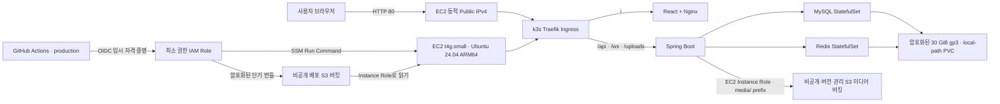

# AWS EC2 + S3 + 단일 노드 k3s 배포 가이드

이 문서는 `talk_with_neighbors`를 서울 리전의 저비용 AWS 환경에 배포하는 절차를 설명한다. 대상은 실제 상용 서비스가 아니라 **DevOps·백엔드 포트폴리오와 짧은 데모**다. 관리형 EKS 대신 ARM64 EC2 한 대의 k3s를 사용하고, 미디어만 비공개 S3로 분리한다.

> **현재 상태 — 2026-07-14:** 서울 리전에서 Terraform 적용을 완료해 `t4g.small` 단일 노드 EC2, 암호화된 EBS, 비공개 미디어·배포 S3 버킷, GitHub OIDC와 SSM 배포 경로가 실제로 생성되어 있다. **현재 리소스는 비용이 발생할 수 있다.** 최초 애플리케이션 배포에서 VPC `10.42.0.0/16`과 k3s 기본 Pod CIDR `10.42.0.0/16`의 충돌을 발견했으며, Pod `10.244.0.0/16`, Service `10.96.0.0/16`, DNS `10.96.0.10`으로 1회 복구하는 중이다. 네트워크 재초기화와 재배포·외부 검증이 끝나기 전까지는 애플리케이션을 정상 배포 상태로 보지 않는다.

이 구성은 고가용성, 무중단 배포, 자동 DB 백업을 보장하지 않는다. 실제 사용자 계정과 비밀번호를 받는 공개 서비스로 사용하기 전에는 최소한 고정 주소, 도메인, TLS, DB 백업을 추가해야 한다.

## 1. 선택한 구조



| 구성 요소 | 현재 선택 | 이유와 한계 |
|---|---|---|
| 컴퓨트 | `t4g.small`, 2 vCPU·2 GiB, ARM64 | 저비용 포트폴리오 기본값. k3s·JVM·MySQL·Redis를 한 노드에서 돌리므로 2 GiB swap과 보수적인 컨테이너 제한을 사용한다. |
| 루트 디스크 | 암호화된 30 GiB gp3 | k3s 이미지·로그·MySQL PVC를 함께 저장한다. EC2를 중지해도 유지되고 과금될 수 있으며, 인스턴스 종료 시 삭제된다. |
| 오케스트레이션 | 단일 노드 k3s + Traefik | EKS 제어부 비용을 피하지만 노드 장애가 곧 전체 서비스 장애다. |
| 미디어 | 비공개·버전 관리 S3 | 앱이 `/uploads/**`로 프록시한다. 브라우저에 버킷이나 AWS 키를 노출하지 않는다. |
| 배포 | GitHub OIDC → S3 번들 → SSM | 장기 AWS 액세스 키와 SSH 22 포트를 사용하지 않는다. |
| 네트워크 | Public subnet + Internet Gateway | NAT Gateway, Load Balancer, Elastic IP는 만들지 않는다. 대신 중지·시작 후 공인 IP가 바뀐다. |
| 클러스터 CIDR | VPC `10.42.0.0/16`, Pod `10.244.0.0/16`, Service `10.96.0.0/16`, DNS `10.96.0.10` | VPC·Pod·Service 대역을 서로 겹치지 않게 고정한다. Terraform plan 단계에서 subnet 포함 관계와 CIDR 중첩을 거부한다. |
| 외부 프로토콜 | 기본은 HTTP 80 | 보안 그룹의 443은 향후 TLS용으로 열려 있지만 현재 Ingress에는 인증서와 HTTPS 라우터가 없다. |

S3 Gateway VPC Endpoint를 사용해 EC2와 S3 사이 경로에 NAT Gateway가 필요하지 않다. Gateway 유형 자체에는 시간당 엔드포인트 요금이 없지만 S3 저장·요청·인터넷 전송 요금은 별도다.

## 2. Terraform이 만드는 리소스

`infra/aws-ec2/`는 다음을 관리한다.

- 전용 VPC, Public subnet 한 개, Internet Gateway, Route Table
- 시간당 요금이 없는 S3 Gateway VPC Endpoint
- 80·443만 인바운드로 허용하고 22는 열지 않는 Security Group
- Canonical Ubuntu 24.04 ARM64 AMI의 `t4g.small` EC2
- 암호화·종료 시 삭제되는 30 GiB gp3 루트 볼륨
- 2 GiB swap, 고정된 k3s 버전, secrets encryption을 설정하는 최초 부팅 스크립트
- VPC·Pod·Service CIDR의 비중첩과 public subnet 포함 관계를 적용 전 차단하는 Terraform precondition
- Pod `10.244.0.0/16`, Service `10.96.0.0/16`, cluster DNS `10.96.0.10`을 명시한 k3s 네트워크 설정
- SSM 관리 권한과 `media/`·`deployments/` prefix만 허용하는 EC2 Instance Role
- 공개 접근 차단, SSE-S3, TLS 외 접근 거부를 적용한 미디어·배포 버킷
- 미디어 버킷 버전 관리와 비현재 버전 기본 30일 보존
- 배포 번들을 하루 뒤 정리하는 별도 S3 lifecycle
- GitHub `production` Environment subject만 신뢰하는 OIDC 배포 Role
- 이메일을 지정했을 때만 생성되는 월 비용 Budget

미디어와 배포 버킷은 기본적으로 `force_destroy = false`다. 실수로 Terraform을 실행해도 비어 있지 않은 버킷을 즉시 삭제하지 못하게 하는 보호 장치다.

## 3. 비용과 Free Tier

2025년 7월 15일 이후 만든 신규 계정은 가입 시 USD 100 크레딧을 받고 활동 완료로 최대 USD 100를 추가로 받을 수 있다. Free account plan은 계정 생성 후 6개월 또는 크레딧 소진 중 먼저 오는 시점까지다. `t4g.small`과 gp3는 신규 계정의 Free Tier eligible 목록에 있지만, **eligible은 모든 사용량이 영구 무료라는 뜻이 아니다.** 계정 plan, 남은 크레딧, AMI와 리전 조건을 Billing 화면에서 직접 확인한다.

2026-07-14 현재 AWS의 T4g 안내에는 `t4g.small`을 2026-12-31까지 월 최대 750시간 시험할 수 있다고도 명시되어 있다. 이 혜택이 계정과 선택한 Ubuntu AMI에 실제 적용되는지는 EC2 생성 화면과 청구서에서 확인한다. 컴퓨트 혜택이 적용되어도 EBS, S3, Public IPv4, snapshot, 초과 데이터 전송이 자동으로 모두 무료가 되는 것은 아니다.

- [신규 AWS Free Tier 안내](https://docs.aws.amazon.com/awsaccountbilling/latest/aboutv2/free-tier.html)
- [EC2 Free Tier 대상과 사용량 확인](https://docs.aws.amazon.com/AWSEC2/latest/UserGuide/ec2-free-tier-usage.html)
- [EC2 T4g 사양과 기간 한정 시험 안내](https://aws.amazon.com/ec2/instance-types/t4/)
- [EC2 On-Demand 가격](https://aws.amazon.com/ec2/pricing/on-demand/)
- [EBS 가격](https://aws.amazon.com/ebs/pricing/)
- [S3 가격](https://aws.amazon.com/s3/pricing/)
- [Public IPv4 과금 설명](https://docs.aws.amazon.com/vpc/latest/userguide/what-is-amazon-vpc.html)

가격은 리전·계정 혜택·세금·환율에 따라 바뀌므로 문서에 고정 월액을 약속하지 않는다. 적용 직전 [AWS Pricing Calculator](https://calculator.aws/)로 서울 리전의 현재 단가를 다시 계산한다.

| 비용 항목 | 언제 비용이 생기는가 | 절약 방법 |
|---|---|---|
| EC2 compute | 인스턴스가 `running`인 시간 | 데모할 때만 시작하고 끝나면 중지한다. `t4g.small` CPU credit은 `standard`로 고정해 unlimited 추가 요금을 피한다. |
| Public IPv4 | 실행 중 EC2에 할당된 공인 IPv4 사용 시간. Free Tier 대상 계정은 EC2용 월 750시간 혜택이 있을 수 있다. | 인스턴스를 중지하면 동적 IP가 해제된다. Elastic IP는 만들지 않는다. |
| EBS gp3 | 30 GiB 볼륨이 존재하는 동안. EC2를 중지해도 계속 존재한다. | 이미지·로그를 정리하고 필요 없으면 `terraform destroy`로 종료한다. |
| S3 미디어 | 현재 객체와 보존 중인 비현재 버전의 GB-month, PUT·GET·LIST, 인터넷 전송 | 비현재 버전은 기본 30일 뒤 만료한다. 큰 테스트 파일과 불필요한 현재 객체는 직접 삭제한다. |
| S3 배포 번들 | 배포할 때의 짧은 저장·요청 | 성공·실패 시 스크립트가 삭제하고, 누락된 객체도 하루 뒤 lifecycle로 만료한다. |
| 스냅샷·데이터 전송 | 수동 EBS snapshot, 인터넷 outbound 등 | 스냅샷 보존 기한을 정하고 Billing에서 전송량을 확인한다. |
| AWS Budget | 이메일을 지정했을 때 월 Budget 생성 | 알림은 지출을 차단하지 않는다. 실제 사용 중지·삭제는 별도로 해야 한다. |

`budget_alert_email`을 설정하면 기본 USD 10 월 Budget에서 실제 80%, 예측 100% 알림을 보낸다. 크레딧이 있어도 **Billing → Credits, Free Tier, Bills, Cost Explorer**를 함께 확인한다.

## 4. 사전 준비

다음이 필요하다.

- AWS CLI v2와 Terraform `>= 1.8, < 2.0`
- 서울 리전에서 VPC, EC2, EBS, S3, IAM, SSM, Budget을 만들 수 있는 로컬 AWS 주체
- 백엔드 GitHub 저장소 관리자 권한
- GHCR에 게시된 ARM64 포함 다중 아키텍처 백엔드·프론트엔드 이미지
- GitHub `production` Environment의 승인자를 정할 계정

루트 사용자의 장기 액세스 키는 만들지 않는다. 로컬 CLI는 가능한 한 AWS IAM Identity Center나 수명이 짧은 관리자 세션을 사용하고, 먼저 대상 계정을 확인한다.

```powershell
aws sts get-caller-identity
aws configure get region
terraform version
```

출력의 AWS Account ID와 ARN이 의도한 포트폴리오 계정인지 확인한다. 다른 계정이면 여기서 멈춘다.

## 5. 과금 없이 검증하기

저장소의 인프라 CI는 `terraform apply`를 호출하지 않는다. PR에서 다음을 검증한다.

- Terraform `fmt`, provider 초기화, `validate`
- Kustomize 렌더링과 kubeconform Kubernetes 스키마 검사
- 배포 Bash의 ShellCheck
- GitHub Actions의 actionlint

로컬에서도 먼저 정적 검증과 mock 기반 기본값 테스트를 실행할 수 있다.

```powershell
Set-Location infra\aws-ec2
terraform init -backend=false -input=false
terraform fmt -check -recursive
terraform validate
terraform test
```

`terraform init`은 provider를 내려받지만 AWS 리소스를 만들지 않는다. 실제 계정 조회와 생성 계획은 다음 절의 `plan`부터 시작한다.

## 6. Terraform 계획과 최초 생성

### 6.1 변수 준비

백엔드 저장소 루트에서 실행한다.

```powershell
Set-Location infra\aws-ec2
Copy-Item terraform.tfvars.example terraform.tfvars
```

기본 예시는 다음 선택을 담고 있다.

```hcl
aws_region        = "ap-northeast-2"
availability_zone = "ap-northeast-2a"

vpc_cidr           = "10.42.0.0/16"
public_subnet_cidr = "10.42.1.0/24"
k3s_cluster_cidr   = "10.244.0.0/16"
k3s_service_cidr   = "10.96.0.0/16"
k3s_cluster_dns    = "10.96.0.10"

instance_type        = "t4g.small"
root_volume_size_gib = 30
k3s_version          = "v1.34.8+k3s1"

# 삭제된 미디어의 비현재 버전을 약 30일 동안만 복구 가능하게 유지한다.
media_noncurrent_version_expiration_days = 30
media_bucket_force_destroy                = false

github_owner       = "gitUserKHS"
github_repository  = "talk_with_neighbors_back"
github_environment = "production"

# 선택: 월 USD 10 Budget과 이메일 알림
budget_alert_email = "you@example.com"
monthly_budget_usd = 10
```

계정에 `https://token.actions.githubusercontent.com` OIDC provider가 이미 있으면 새로 만들지 않도록 기존 ARN을 넣는다.

```hcl
github_oidc_provider_arn = "arn:aws:iam::123456789012:oidc-provider/token.actions.githubusercontent.com"
```

`terraform.tfvars`, `*.tfstate*`, `tfplan`은 커밋하지 않는다. 현재 Terraform backend 구성은 local이며, 실제 적용 state는 저장소 밖에 보관하고 비공개·암호화 S3에도 백업했다. 이 백업은 state locking을 제공하지 않으므로 동시에 Terraform을 실행하지 않는다. 팀 운영으로 바꾸면 잠금과 암호화를 지원하는 remote state를 먼저 도입한다.

### 6.2 계획 검토

```powershell
terraform init
terraform fmt -check -recursive
terraform validate
terraform plan -out=tfplan
terraform show tfplan
```

적용 전에 최소한 다음을 확인한다.

- Account와 리전이 의도한 계정, `ap-northeast-2`인가
- public subnet이 VPC 안에 있고 VPC·Pod·Service CIDR이 서로 겹치지 않는가
- k3s DNS 주소가 Service CIDR 안에 있고 `10.96.0.10`으로 의도대로 설정됐는가
- AMI는 Ubuntu 24.04 ARM64이고 인스턴스는 `t4g.small`인가
- 루트 볼륨은 암호화된 gp3 30 GiB이며 `delete_on_termination = true`인가
- 인바운드는 80·443뿐이고 22·3306·6379·8080은 공개되지 않았는가
- NAT Gateway, Load Balancer, Elastic IP, EKS가 계획에 없는가
- OIDC subject가 정확히 `repo:gitUserKHS/talk_with_neighbors_back:environment:production`인가
- 미디어 버킷은 versioning·public access block·30일 비현재 버전 lifecycle을 갖는가
- `force_destroy`가 두 버킷 모두 `false`인가
- Budget 이메일과 한도가 의도한 값인가

### 6.3 명시적으로 생성 — 현재 적용 완료

2026-07-14 현재 이 프로젝트 계정에는 아래 절차로 실제 리소스가 생성되어 있다. 처음부터 다시 구축하거나 별도 계정에 복제할 때 다음 명령은 AWS 리소스를 만들며 비용이 발생할 수 있다. 검토한 `tfplan`과 대상 계정을 다시 확인한 뒤에만 실행한다.

```powershell
terraform apply tfplan
terraform output
```

최초 부팅은 swap, AWS CLI, SSM Agent, k3s를 설치한다. 몇 분 걸릴 수 있다. SSH 대신 다음으로 상태를 확인한다.

```powershell
$InstanceId = terraform output -raw instance_id
aws ec2 wait instance-status-ok --region ap-northeast-2 --instance-ids $InstanceId

aws ssm describe-instance-information `
  --region ap-northeast-2 `
  --filters "Key=InstanceIds,Values=$InstanceId" `
  --query "InstanceInformationList[0].[PingStatus,PlatformName,AgentVersion]" `
  --output table
```

`PingStatus`가 `Online`이어야 GitHub 배포가 가능하다. Bootstrap 실패는 SSM Session Manager나 EC2 Serial Console 권한을 별도로 준비해 `/var/log/talk-with-neighbors-bootstrap.log`와 `journalctl -u k3s`를 확인한다. 보안 그룹에 임시 SSH 22를 추가하는 절차는 기본 운영 경로가 아니다.

## 7. GitHub `production` Environment 설정

백엔드 저장소의 **Settings → Environments → production**을 만든다.

- Deployment branches는 `main`만 허용한다.
- Required reviewers를 최소 한 명 지정한다.
- 가능하면 관리자 우회 배포를 막는다.
- OIDC Role의 `github_environment` 이름과 철자·대소문자가 같아야 한다.

Terraform 출력값을 Environment variables로 등록한다.

| Variable | 값 |
|---|---|
| `AWS_REGION` | `ap-northeast-2` |
| `AWS_DEPLOY_ROLE_ARN` | `terraform output -raw github_deploy_role_arn` |
| `EC2_INSTANCE_ID` | `terraform output -raw instance_id` |
| `DEPLOY_BUCKET` | `terraform output -raw deployment_bucket_name` |
| `MEDIA_BUCKET` | `terraform output -raw media_bucket_name` |
| `K3S_NETWORK_REINITIALIZE_ALLOWED` | 평소 `false` 또는 미설정. 승인된 1회 CIDR 복구 창에만 잠시 `true` |

Environment secrets는 다음과 같다.

| Secret | 규칙 |
|---|---|
| `MYSQL_PASSWORD` | 앱 전용 DB 사용자 비밀번호, 서로 다른 난수 16자 이상 |
| `MYSQL_ROOT_PASSWORD` | MySQL root 비밀번호, 서로 다른 난수 16자 이상 |
| `JWT_SECRET` | JWT 서명용 난수 32자 이상 |
| `GHCR_USERNAME` | private GHCR 이미지를 읽을 사용자. 패키지가 public이면 비워도 된다. |
| `GHCR_TOKEN` | 위 사용자의 최소 `read:packages` 토큰. `GHCR_USERNAME`과 함께 설정하거나 둘 다 비운다. |

AWS access key와 secret key는 GitHub에 저장하지 않는다. GitHub Actions는 `id-token: write`로 OIDC 토큰을 받아 1시간 이하의 임시 AWS 자격 증명으로 교환한다. 신뢰 정책은 지정 저장소의 `production` Environment subject만 허용한다. 자세한 원리는 [AWS IAM OIDC](https://docs.aws.amazon.com/IAM/latest/UserGuide/id_roles_providers_oidc.html)와 [GitHub AWS OIDC 가이드](https://docs.github.com/en/actions/how-tos/secure-your-work/security-harden-deployments/oidc-in-aws)를 참고한다.

애플리케이션 secret은 실행 시 private 배포 버킷을 거쳐 Kubernetes Secret으로 적용된다. runner와 노드의 평문 임시 파일은 성공·실패와 관계없이 정리하고, 배포 버킷 lifecycle이 하루 뒤 잔여 객체를 정리한다. k3s secrets encryption도 켜져 있지만 클러스터 관리자와 EC2 root는 Secret을 읽을 수 있으므로 이들을 신뢰 경계로 본다.

## 8. 이미지 게시와 배포

### 8.1 검증된 다중 아키텍처 이미지 만들기

EC2가 Graviton ARM64이므로 백엔드와 프론트엔드 이미지는 반드시 `linux/amd64,linux/arm64`를 포함해야 한다. 각 저장소의 `publish-image.yml`은 다음 순서로 처리한다.

1. 단위·통합 테스트와 프로덕션 빌드를 통과한다.
2. 격리된 candidate tag로 다중 아키텍처 이미지를 GHCR에 push한다.
3. push된 정확한 digest를 Trivy로 `HIGH`, `CRITICAL` 취약점 검사한다.
4. 같은 digest를 컨테이너 스모크 테스트한다.
5. 성공한 digest만 `main`, commit SHA, `latest` tag로 승격한다.

배포에는 변경 가능한 tag가 아니라 워크플로 summary의 불변 주소를 사용한다.

```text
ghcr.io/gituserkhs/talk_with_neighbors_back@sha256:<64자리 digest>
ghcr.io/gituserkhs/talk_with_neighbors_front@sha256:<64자리 digest>
```

### 8.2 배포 실행

백엔드 저장소의 **Actions → Deploy EC2 k3s production → Run workflow**에서 `main`을 선택한다.

| 입력 | 내용 |
|---|---|
| `backend_image` | 백엔드의 전체 GHCR digest 주소 |
| `frontend_image` | 프론트엔드의 전체 GHCR digest 주소 |
| `public_origin` | 보통 비운다. 현재 EC2 공인 IP로 `http://...`를 자동 계산한다. |
| `start_if_stopped` | EC2가 중지되어 있으면 시작하고 배포하려면 체크한다. |
| `reinitialize_k3s_network` | 기존 단일 노드의 k3s 네트워크를 백업 후 1회 재초기화할 때만 `true`. 정상 배포는 `false` |
| `reinitialize_confirmation` | 재초기화 때만 인스턴스 ID와 목표 CIDR을 포함한 정확한 확인 문구. 정상 배포는 빈 값 |

워크플로는 다음을 자동 수행한다.

1. `main`, Environment 승인, digest 형식, secret 길이를 검증한다.
2. OIDC로 AWS 임시 자격 증명을 받는다.
3. 선택 시 EC2를 시작하고 현재 동적 공인 IP와 SSM `Online` 상태를 확인한다.
4. S3·DB·JWT·선택적 GHCR 설정이 든 private 배포 번들을 만든다.
5. 번들을 SSE-S3로 업로드하고 SSM `AWS-RunShellScript`를 실행한다.
6. 승인된 1회 복구 입력일 때만 root 전용 백업 후 k3s 네트워크를 재초기화한다.
7. 노드에서 정확한 이미지 digest를 매니페스트에 주입하고 k3s에 적용한다.
8. MySQL과 Redis를 먼저 준비한 뒤 백엔드·프론트엔드 rollout과 백엔드 readiness를 확인한다.
9. 외부 `/healthz` 응답 본문과 실제 DB 조회 API를 엄격하게 스모크 테스트한다.
10. runner·S3·노드의 평문 임시 파일을 정리한다.

배포 번들은 secret을 포함하므로 콘솔에서 다운로드하거나 보관하지 않는다. 배포 Role은 지정 instance와 deployment prefix에만 필요한 권한을 갖고, EC2 Role은 media·deployment prefix만 접근한다. 애플리케이션에는 정적 AWS 키를 주입하지 않고 EC2 Instance Role의 임시 자격 증명을 사용한다.

### 8.3 현재 노드의 1회 네트워크 복구

최초 생성된 현재 노드는 k3s 기본 Pod CIDR과 VPC가 모두 `10.42.0.0/16`이라서 Pod의 외부 DNS·S3 통신과 Traefik 설치가 실패할 수 있다. Terraform은 데이터가 있는 인스턴스의 우발적 교체를 막기 위해 `ami`와 `user_data` 변경을 무시한다. 따라서 **Terraform을 다시 적용하는 것만으로 현재 노드의 k3s CIDR은 바뀌지 않는다.** 아래의 보호된 1회 복구 워크플로를 사용한다.

재초기화는 k3s 제어면과 workload 상태를 다시 만드는 파괴적 유지보수다. 실패한 포트폴리오 단일 노드를 복구하는 경우에만 실행하고, 정상 클러스터의 일반 배포 절차로 사용하지 않는다.

1. Terraform plan에서 목표값이 Pod `10.244.0.0/16`, Service `10.96.0.0/16`, DNS `10.96.0.10`이고 VPC와 겹치지 않는지 확인한다.
2. GitHub `production` Environment에 `K3S_NETWORK_REINITIALIZE_ALLOWED=true`를 잠시 설정하고 required reviewer 승인을 유지한다.
3. `main`의 **Deploy EC2 k3s production**에서 `reinitialize_k3s_network=true`를 선택한다.
4. `reinitialize_confirmation`에 아래 문구를 입력한다. `<EC2_INSTANCE_ID>`는 `production` Environment의 실제 값으로 바꾸고 공백을 넣지 않는다.

```text
REINITIALIZE_K3S_NETWORK:<EC2_INSTANCE_ID>:pods=10.244.0.0/16:services=10.96.0.0/16:dns=10.96.0.10
```

워크플로는 `main`, `production`, Environment 토글, boolean 입력, 인스턴스별 확인 문구가 모두 맞을 때만 진행한다. 실행 전 기존 k3s server 디렉터리와 설정 파일, MySQL 논리 dump를 EC2의 root 전용 백업 위치에 저장하고 무결성을 확인한다. PVC 복구 가능성을 훼손할 수 있으므로 `k3s-uninstall.sh`는 사용하지 않는다. 백업 뒤 k3s 네트워크를 목표 CIDR로 다시 만들고 노드·CoreDNS·Traefik을 확인한다. 이어서 MySQL을 다시 만들고 백업 dump를 한 번 복원한 뒤에만 백엔드를 시작한다. 커밋 전 실패에는 기존 server 상태와 설정으로 자동 롤백을 시도하며, root 전용 백업은 수동 복구를 위해 남긴다.

재초기화가 MySQL dump나 k3s server archive를 만들기 전 `preparing-backup` 단계에서만 실패했다면, 다음 승인 실행은 root 소유 journal·백업 경로, 기존 replica 수, 파괴 단계 artifact 부재를 모두 다시 확인한다. 조건이 정확히 맞을 때만 이전 journal을 해당 백업의 `aborted-before-destructive.json`으로 보존하고 새 시도를 시작한다. 다른 phase이거나 dump·server archive가 하나라도 있으면 자동 재시도를 거부하므로 root 전용 journal과 백업을 먼저 조사해야 한다. 네트워크 마이그레이션 완료 뒤 애플리케이션 배포만 실패한 경우에는 `reinitialize_k3s_network=false`와 빈 확인 문구로만 재배포한다.

성공 후에는 다음을 바로 수행한다.

1. `K3S_NETWORK_REINITIALIZE_ALLOWED`를 `false`로 바꾸거나 삭제한다.
2. 같은 검증된 이미지 digest로 `reinitialize_k3s_network=false`, `reinitialize_confirmation` 빈 값의 정상 배포를 한 번 더 실행한다.
3. Pod CIDR, CoreDNS, Traefik, 백엔드 readiness, S3 미디어, 외부 `/healthz`와 사용자 시나리오를 확인한다.
4. root 전용 백업은 복구가 불필요함을 확인한 뒤 별도 유지보수에서 보존 또는 삭제한다.

### 8.4 수동 확인

배포 summary의 URL로 다음을 확인한다.

```powershell
$Origin = "http://<현재-공인-IP>"
curl.exe --fail --show-error "$Origin/healthz"
curl.exe --fail --show-error "$Origin/api/auth/check-duplicates?email=smoke%40example.invalid&username=smoke"
```

추가 수동 시나리오는 최소 다음을 포함한다.

- 서로 다른 세 사용자 가입·로그인과 세션 유지
- 게시글·댓글 작성, 수정, 삭제와 숨김·차단 권한
- WebSocket 채팅 송수신, 재접속, 메시지 수정·삭제
- 이미지 여러 장, 동영상, 파일 업로드·Range 재생·다운로드
- 업로드 후 백엔드 Pod 재시작에도 S3 미디어가 유지되는지
- EC2 재부팅 후 MySQL·Redis PVC와 S3 미디어가 유지되는지
- 80·443 외 22·3306·6379·8080이 인터넷에 공개되지 않았는지

배포 자동화의 스모크 테스트가 전체 사용자 여정을 대신하지는 않는다.

## 9. 중지·시작과 동적 IP

백엔드 저장소의 **Actions → Control portfolio EC2**에서 `status`, `start`, `stop`을 실행할 수 있다. 이 워크플로도 `production` 승인과 OIDC를 사용한다.

CLI로 직접 실행하려면 다음과 같다.

```powershell
$InstanceId = terraform -chdir=infra/aws-ec2 output -raw instance_id
aws ec2 stop-instances --region ap-northeast-2 --instance-ids $InstanceId
aws ec2 wait instance-stopped --region ap-northeast-2 --instance-ids $InstanceId

aws ec2 start-instances --region ap-northeast-2 --instance-ids $InstanceId
aws ec2 wait instance-running --region ap-northeast-2 --instance-ids $InstanceId
aws ec2 describe-instances --region ap-northeast-2 --instance-ids $InstanceId `
  --query "Reservations[0].Instances[0].PublicIpAddress" --output text
```

중지는 종료가 아니다. 중지 중에는 EC2 compute 과금이 멈추지만 EBS와 S3는 남고 비용이 발생할 수 있다.

Elastic IP가 없으므로 stop/start 뒤 Public IPv4가 바뀐다. **시작만 하지 말고 `Deploy EC2 k3s production`을 다시 실행하는 것을 기본 절차로 삼는다.** 워크플로가 새 IP를 `public-origin`과 CORS 설정에 반영하고 외부 스모크 테스트까지 다시 수행한다. 가장 간단한 방법은 배포 워크플로에서 `start_if_stopped = true`를 선택하는 것이다.

## 10. 현재 HTTP 한계

기본 Ingress는 `web` entrypoint만 사용하고 배포 스크립트도 `http://` origin만 허용한다. 443 Security Group 규칙이 있어도 TLS 인증서와 HTTPS listener가 자동 생성되는 것은 아니다.

따라서 현재 배포는 짧은 포트폴리오 시연 전용이다.

- 공용 네트워크에서 실제 비밀번호나 민감한 채팅을 입력하지 않는다.
- 브라우저의 Secure cookie를 켤 수 없으므로 세션 보호가 완전하지 않다.
- 동적 IP라 URL이 안정적이지 않다.
- 프론트엔드와 미디어도 CloudFront 없이 단일 EC2를 통과한다.

실제 공개 전에 다음을 별도 변경으로 구현한다.

1. Elastic IP 또는 안정된 앞단을 선택하고 비용을 계산한다.
2. 도메인 DNS를 연결한다.
3. Traefik에 유효한 TLS 인증서 발급·갱신과 HTTP→HTTPS redirect를 구성한다.
4. 배포 입력과 runtime config가 `https://`와 `cookie-secure = true`를 지원하게 바꾼다.
5. HSTS, WebSocket `wss://`, CORS, 업로드·다운로드를 다시 테스트한다.

## 11. 관찰과 장애 조사

SSH 없이 SSM Run Command나 Session Manager를 사용한다. 배포 실패 시 GitHub Actions에는 SSM 표준 출력·오류가 남는다. 추가로 확인할 항목은 다음과 같다.

```bash
sudo k3s kubectl get nodes
sudo k3s kubectl -n talk-with-neighbors get pods,pvc,ingress
sudo k3s kubectl -n talk-with-neighbors describe pod <pod-name>
sudo k3s kubectl -n talk-with-neighbors logs deployment/backend --tail=300
sudo journalctl -u k3s --no-pager -n 300
sudo tail -n 300 /var/log/talk-with-neighbors-bootstrap.log
```

현재 구성에는 CloudWatch Container Insights나 중앙 로그 수집이 없다. 비용을 아끼는 대신 인스턴스가 손상되면 로컬 로그도 사라질 수 있다. 포트폴리오 시연 중에는 최소한 GitHub 배포 로그, SSM command ID, 이미지 digest, 테스트 결과를 릴리스 증적으로 남긴다.

### 11.1 OS·AMI·k3s 업그레이드

MySQL과 Redis가 EC2 루트 EBS에 있기 때문에 Canonical의 `current` AMI나 bootstrap 변경만으로 인스턴스가 자동 교체되면 데이터가 사라질 수 있다. 이를 막기 위해 Terraform은 `ami`와 `user_data` 변경을 무시하고 `user_data_replace_on_change = false`를 사용한다. 따라서 새 AMI나 bootstrap 값이 plan에 바로 반영되지 않는 것은 의도된 동작이다. 특히 기존 EC2의 k3s CIDR은 Terraform 재적용으로 바뀌지 않으므로, 현재의 CIDR 충돌 복구에는 8.3절의 보호된 1회 재초기화를 사용한다.

보안 업데이트는 SSM으로 기존 노드에 적용하고, k3s 업그레이드는 DB 논리 백업과 EBS snapshot을 만든 뒤 별도의 유지보수 작업으로 수행한다. 새 AMI로 교체해야 할 때는 자동 교체에 맡기지 말고 새 노드 생성, DB 복원, S3 연결, 애플리케이션 검증, 트래픽 전환 순서를 명시적으로 계획한다.

## 12. 롤백과 데이터 복구

### 12.1 애플리케이션 롤백

자동으로 이전 버전으로 되돌리는 blind rollback은 하지 않는다. 마지막으로 정상 확인한 백엔드·프론트엔드 digest를 `deploy-k3s.yml`에 다시 입력하고 동일한 rollout·readiness·외부 스모크 테스트를 거친다.

DB schema 변경은 이미지 롤백으로 되돌아가지 않는다. 현재는 Hibernate `ddl-auto=update`를 사용하고 Flyway 같은 명시적 migration 도구가 아직 없으므로, 공개 운영 전에 migration을 버전 관리하고 하위 호환 가능한 expand/contract 방식으로 나눠야 한다. 파괴적 migration 전에는 논리 백업과 복구 시험을 먼저 한다.

### 12.2 MySQL과 노드 디스크

MySQL은 EC2 루트 EBS의 local-path PVC에 있다. EC2 stop/start에는 유지되지만 인스턴스 종료나 볼륨 손상에는 안전하지 않다. 현재 자동 `mysqldump`, 별도 RDS, 자동 EBS snapshot은 구현되어 있지 않다.

중요한 데모 데이터가 생기기 전 최소 운영 보강은 다음과 같다.

1. 정기 `mysqldump`를 암호화된 별도 백업 위치에 저장한다.
2. 복원용 빈 DB에서 실제로 dump를 복구해 본다.
3. 파괴적 작업 전 앱을 중지하고 수동 EBS snapshot을 만든다.
4. snapshot 완료 상태와 보존 기한을 기록한다.

EBS snapshot은 별도 비용이 들고 Terraform이 관리하지 않으므로, 인프라를 삭제한 뒤에도 남아 과금될 수 있다. 파일 시스템 snapshot만으로 MySQL 논리 일관성을 항상 보장하지 않으므로 `mysqldump`를 대체하지 않는다.

### 12.3 S3 미디어

미디어 버킷은 버전 관리가 켜져 있고, 삭제·덮어쓰기된 객체의 비현재 버전은 기본 약 30일 뒤 만료된다. 이 기간은 실수 복구 창이지 장기 백업이 아니다. 현재 객체는 이 비현재 버전 lifecycle의 만료 대상이 아니다.

```powershell
$Bucket = terraform -chdir=infra/aws-ec2 output -raw media_bucket_name
aws s3api list-object-versions --bucket $Bucket --prefix "media/<object-key>"
```

필요한 version을 같은 key의 새 현재 버전으로 복사할 수 있다. 다만 DB 레코드까지 삭제됐다면 S3 객체만 복원해도 화면에 다시 나타나지 않으므로 DB 복구와 함께 처리한다.

## 13. 완전 삭제

`stop`은 비용을 완전히 없애지 않는다. 포트폴리오 실습을 끝냈다면 다음 순서로 삭제한다.

1. 필요한 DB dump, S3 미디어, 배포 digest, Terraform state를 백업한다.
2. 수동 EBS snapshot이 있으면 보존 또는 삭제를 결정한다.
3. Terraform 디렉터리에서 `terraform plan -destroy`를 검토한다.
4. 배포 버킷을 비운다.
5. 미디어 버킷의 **현재 객체, 모든 version, delete marker**를 비운다.
6. `terraform destroy`를 실행한다.
7. Billing과 Resource Explorer에서 EC2, EBS volume·snapshot, S3, Public IPv4, Budget 잔여 항목을 확인한다.

```powershell
Set-Location infra\aws-ec2
terraform plan -destroy

$DeployBucket = terraform output -raw deployment_bucket_name
aws s3 rm "s3://$DeployBucket" --recursive
```

버전 관리 버킷에서 `aws s3 rm --recursive`만 실행하면 이전 version과 delete marker가 남는다. 미디어 버킷은 AWS S3 콘솔의 **Empty** 기능으로 모든 version을 포함해 비우거나, 검증된 version-aware 삭제 스크립트를 사용한다. 버킷 이름과 계정을 두 번 확인한다.

```powershell
terraform destroy
```

`media_bucket_force_destroy = true`로 우회하면 실수 한 번에 미디어 version까지 삭제될 수 있으므로 기본값을 유지한다. Terraform이 이 계정의 GitHub OIDC provider까지 최초 생성했다면 destroy가 그 provider도 삭제한다. 다른 저장소가 공유해야 한다면 처음부터 `github_oidc_provider_arn`으로 기존 provider를 참조해 수명 주기를 분리한다.

루트 EBS는 인스턴스 종료 시 삭제된다. 수동 snapshot, Terraform이 관리하지 않는 객체, GHCR package, DNS는 별도로 확인해야 한다.

## 14. 보안·운영 체크리스트

- [ ] `terraform apply` 전 AWS Account ID, 리전, plan과 예상 비용을 검토했다.
- [ ] VPC·Pod·Service CIDR이 서로 겹치지 않고 DNS가 Service CIDR 안에 있다.
- [ ] Free Tier 종료일과 남은 Credits를 확인했다.
- [ ] Budget 이메일 알림을 설정하고 수신 여부를 확인했다.
- [ ] GitHub `production`에 `main` 제한과 required reviewer가 있다.
- [ ] GitHub와 Kubernetes 어디에도 장기 AWS access key가 없다.
- [ ] 배포 입력은 tag가 아니라 검증된 `@sha256:` digest다.
- [ ] GHCR 이미지는 `linux/arm64`를 포함한다.
- [ ] SSH 22, MySQL 3306, Redis 6379, 백엔드 8080이 공개되지 않았다.
- [ ] 미디어·배포 S3 Public Access Block과 TLS deny policy가 유지된다.
- [ ] 배포 뒤 rollout, readiness, 외부 API, 채팅, 다중 미디어 시나리오를 확인했다.
- [ ] EC2를 다시 시작한 뒤 새 동적 IP로 재배포했다.
- [ ] 1회 네트워크 복구 후 `K3S_NETWORK_REINITIALIZE_ALLOWED`를 `false`로 바꾸거나 삭제했고 이후 배포 입력도 reset 비활성 상태다.
- [ ] 중요한 DB 데이터의 논리 백업과 실제 복구 시험이 있다.
- [ ] HTTP 데모에는 실제 사용자 자격 증명이나 민감 정보를 넣지 않는다.
- [ ] 사용하지 않을 때 EC2를 중지하고, 실습 종료 후 EBS·S3·snapshot까지 삭제 확인한다.

## 15. 이 구성을 확장해야 하는 기준

다음 중 하나가 필요해지면 단일 노드 포트폴리오 구성을 그대로 운영하지 않는다.

- 실제 사용자 계정과 민감한 채팅을 상시 처리한다.
- 노드 장애에도 서비스를 유지해야 한다.
- DB의 자동 백업, 시점 복구, 장애 조치가 필요하다.
- 동영상 변환 작업이 API 요청과 자원을 경쟁한다.
- 여러 백엔드 replica와 분산 WebSocket·스케줄러 조정이 필요하다.
- 안정된 도메인, TLS, CDN, WAF, 관찰성이 필요하다.

그때의 우선순위는 보통 **TLS·고정 주소 → 자동 DB 백업 또는 RDS → 비동기 미디어 worker → CloudFront → 다중 노드/관리형 Kubernetes 검토**다. EKS는 제어부와 워커 비용, 운영 복잡도를 모두 계산한 뒤 선택한다.
